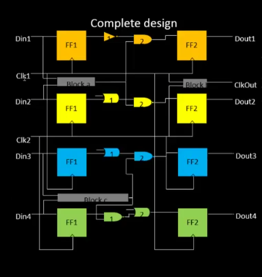
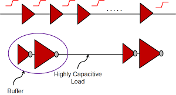
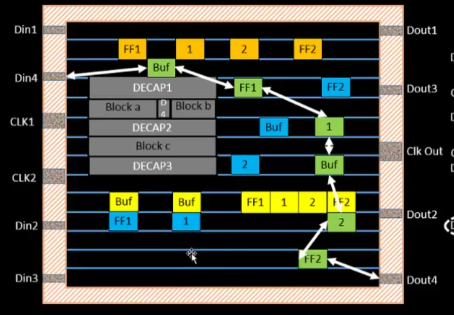
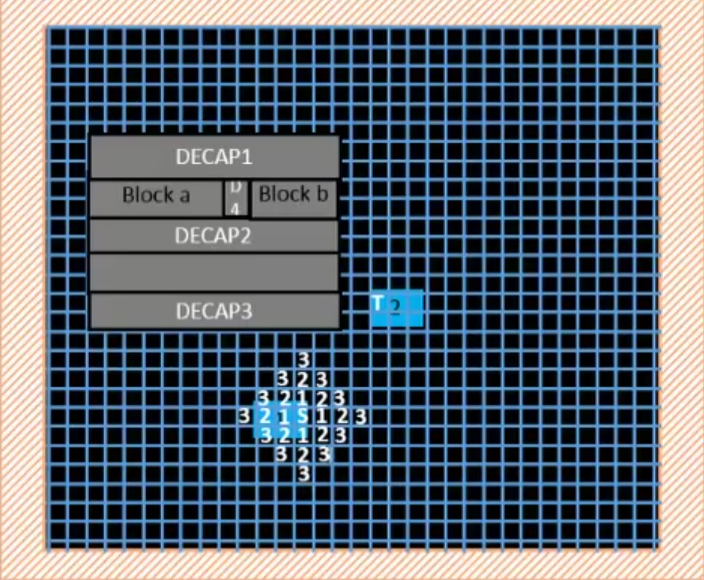

# ASIC Design Flow

Welcome to the ASIC (Application-Specific Integrated Circuit) Design Flow document. This document serves as a comprehensive guide to the various stages involved in the design and development of ASICs. Whether you're a beginner looking to understand the basics or an experienced engineer seeking to refresh your knowledge, this document aims to provide valuable insights into the ASIC design process.

## Table of Contents

- [ASIC Design Flow](#asic-design-flow)
  - [Table of Contents](#table-of-contents)
    - [ASIC DESIGN FLOW](#asic-design-flow-1)
- [Steps in RTL to GDSII Flow](#steps-in-rtl-to-gdsii-flow)
    - [Specification and Architecture](#specification-and-architecture)
  - [Logic Design / Functional Verification](#logic-design--functional-verification)
  - [RTL Synthesis](#rtl-synthesis)
  - [Floorplanning \& Powerplanning](#floorplanning--powerplanning)
  - [Placement](#placement)
  - [Clock Tree Synthesis](#clock-tree-synthesis)
  - [Static Timing Analysis](#static-timing-analysis)
  - [Routing](#routing)
  - [Sign Off](#sign-off)
  - [GDSII](#gdsii)
    - [Conclusion](#conclusion)

---

---
### ASIC DESIGN FLOW

-------------------

Very-large-scale integration is the process of creating an integrated circuit by combining millions or billions of MOS transistors onto a single chip. VLSI began in the 1970s when MOS integrated circuit chips were developed and then widely adopted, enabling complex semiconductor and telecommunication technologies. 

The “Y chart” in VLSI (Very Large Scale Integration) refers to a graphical representation that illustrates the interrelation between the design, fabrication, and test processes in semiconductor manufacturing. It is called the “Y chart” because of its shape, which resembles the letter “Y” .

# Steps in RTL to GDSII Flow
---------------------------------

RTL     - Register Transfer level

GDSII - Graphic Design System II 

The RTL to GDSII flow is a process in VLSI design that converts an RTL description of a digital circuit into a physical layout ready for fabrication. It involves stages like RTL synthesis, floor planning, placement, routing, and ultimately generating the GDSII file format, which contains the layout data. This meticulous process ensures the final IC layout accurately reflects the desired functionality and meets fabrication requirements 

---
 ### Specification and Architecture
---
 

 The first step in VLSI design involves defining specifications, which outline requirements for functionality, performance, power consumption, area constraints, technology node, interfaces, reliability, and cost targets. These specifications guide the design process, ensuring that the resulting integrated circuit meets the desired criteria and fulfills its intended purpose effectively and efficiently. 
  

## Logic Design / Functional Verification

RTL (Register Transfer Level) design involves describing digital circuits at a level where data is transferred between registers. Functional verification ensures that the RTL design behaves as intended. Simulations, primarily used for verification, involve test benches with stimuli and expected responses. RTL is specified in either of the following languages.

  

## RTL Synthesis

RTL synthesis is a key stage in VLSI design where RTL descriptions of digital circuits are converted into gate-level netlists. This involves mapping RTL constructs to logic gates and flip-flops from a technology library while optimizing for area, timing, and power. The output is a gate-level netlist used for subsequent design stages like physical design and verification.
Convertes RTL to a circuit out of components from the Standard cell Library(SCL)

<u>**Standard Cell:**</u> 

Standard cells are pre-designed components used in VLSI design to build digital integrated circuits efficiently. They come in libraries containing various logic functions like AND, OR, and flip-flops. Each cell is characterized by its performance, power, and area metrics. Designers use these cells as building blocks to create custom digital circuits.

Standard cells are of different sizes and may be same cells is of different sizes and properties.

  
## Floorplanning & Powerplanning 

<u> **Floorplanning:** </u>

 Floorplanning involves determining the locations, shape, size of modules in a chip and as such it estimates the chip area, delay and the wiring congestion, thereby providing a ground work for layout. Partitining is one of the process which plays a key role before floorplanning. Design partitioning is the practice of dividing a system on chip (SoC) into small blocks. This allows you to efficiently manage semiconductor designs as a related set of functional blocks. 
It is importat to note that the partitioning should be done in such a way that the intrconnections between the partitioned blocks should be minimum.

Partitioning and Floor Planning are two of the design processes in the VLSI design and are used to reduce the size of the circuit. Floorplanning includes partition of chip die into different system blocks and also I/O pads.

Every module has been assigned an appropriate area and aspect ratio.
Every pin of the module has connection with other modules or periphery
of the chip.
Modules are arranged in a way such that it consumes lesser area on a chip.

<u> **Power Planning :** </u> 

Power planning is a sub-step of floor planning in a physical design flow. In this step we route the VDD & VSS, usually as a mesh grid in order to equally supply the power across design by reducing the IR-drop due to the metal resistance.  
During power planning, the VDD and VSS rails also have to be defined. Objective of power planning is to meet It involves the distribution of power supplies and design of power distribution networks(PDN) to ensure stable and reliable power delivery to all components. Power planning involves- calculating number of power pins required, number of rings and straps, width of rings and straps and IR drop. These are placed on the upper metal layers, as these have to be thicker than the lower metal layers, to have low resistance. 
Power planning includes performing power integrity analysis to ensure that the voltage levels across the chip remain within specified tolerances under varying operating conditions. 

There are different types types of floorplannings which involves different pre-designed functional blocks.Her we are going to learn about two types of which includes the placement of pre-designed functional blocks.

<u>**Macro Planning or Macro Placement:**</u>  
Macro planning allows you to determine how much shelf space each of your product groups should get and how the space should be divided up according to the overall sales contribution and importance. 

<u>**Macros:**</u>  Macros are predefined functional blocks with specific functionalities, such as processors, memory arrays, I/O interfaces. Macros are typically designed and verified independently and are then integrated into the chip design as reusable components.

During macro placement, designers make strategic decisions regarding the placement of macros based on various factors including functional hierarchy, connectivity, power and signal integrity considerations, and physical design constraints.

<u>**IP integration or IP block placement:**</u> 
The floorplanning of IPs (Intellectual Properties) is commonly referred to as "IP integration" or "IP block placement" in the context of VLSI (Very Large Scale Integration) design. This process involves organizing and positioning IP cores within the chip's silicon die to optimize chip layout, signal routing, power distribution, and other design considerations. 

<u>**IP’s:**</u>  
These are pre-designed and pre-verified functional units or modules that serve specific purposes within an integrated circuit (IC) or chip design. Semiconductor IP cores are essential building blocks used by chip designers to accelerate the development process, reduce design complexity, and achieve faster time-to-market for new semiconductor products. 
Semiconductor IPs can include various types of functional blocks, such as Processor cores, memory cores, interface controllers etc.

IP’s are also called as Preplaced cells. Automated placement and routing tools places the remaining logical cells in the design onto chip.
This floorplanning should follow certain rules to maintain signal integrity and meet timing requirements.

<u>**Differences between Macros & IP’s :**</u>  
Macros and IPs serve as reusable functional blocks in VLSI design, yet they differ in ownership, licensing, design processes, customization options, and market availability. Macros are internally developed and owned by the designing company, tailored to specific chip requirements, and not typically licensed externally. IPs, on the other hand, are commercially available from IP vendors, undergoing rigorous design and verification processes, and are licensable for integration into multiple projects. While macros can be customized to some extent, IPs often offer more configurable options. Despite similarities in functionality, their distinctions lie in their origin, accessibility, and flexibility within the chip design ecosystem. 

<u>**Concepts of Floorplanning :**</u>  

In VLSI design, floorplanning is a critical early-stage process that involves the arrangement of functional blocks and components within the chip area, known as the die.

<u>**Die :**</u>   The term "die" typically refers to the individual unit of a semiconductor wafer that contains the integrated circuit (IC) or chip. 

<u>**Core :**</u>   A "core" typically refers to a fundamental processing unit or functional block within an integrated circuit (IC) or system-on-chip (SoC). Cores are designed to perform specific tasks or functions and are often modular, reusable components that can be integrated into larger designs.  

In VLSI design, core and die dimensions adhere to strict rules ensuring optimal functionality and manufacturability. These rules cover aspects like aspect ratio constraints, minimum dimensions, spacing rules, alignment guidelines, clearance requirements, power distribution, routing channels, and thermal management. Compliance with these rules guarantees efficient chip performance and reliability 

<u>**Utilization rate:**</u>  It is the ratio of the total cell area (for hard macros and standard cells or soft macro cells) to the core area.

<u>**Aspect ratio:**</u>   Aspect ratio will decide the size and shape of the chip. It is the ratio between horizontal routing resources to vertical routing resources (or) ratio of height and width. 
Aspect ratio is a critical parameter in semiconductor manufacturing as it affects various aspects of the fabrication process, including lithography, etching, and dopant diffusion. Designers often optimize aspect ratios to meet performance, power and manufacturability requirements in integrated circuit designs.

The following example, the utilization rate is 100% that is the chip is completely used by the functional blocks and the aspect ratio is 1 representing the shape of the die as square.

In the following example, the Utilization rate is 50% indicating that the half of the part of the die area is occupied by the functional blocks or macros or IP’s. And the aspect ratio is 0.5 representing a rectangle shape.

<u>**Concepts of PowerPlanning:**</u> 

<u>**Decoupling Capacitance:**</u>  Decoupling capacitors are strategically placed within the power distribution network of a VLSI chip to ensure stable and reliable operation. They help mitigate voltage fluctuations caused by sudden changes in current demand, thereby improving noise immunity and reducing the risk of functional failures. 
One of the primary functions of decoupling capacitors is to regulate the local voltage levels within the chip. They act as charge reservoirs, supplying additional current to the circuits during transient events, such as switching activities or clock edges, to maintain stable voltage levels. As these decoupling capacitors are of hge size and they are highy charged, they can maintain a constant voltage levels for a long time.
Decoupling capacitors absorb high-frequency noise generated by switching activities in digital circuits. By providing a low-impedance path to ground, they effectively filter out noise from the power supply lines, preventing it from propagating to other parts of the chip and causing interference or signal integrity issues 
Decoupling capacitors plays a crucial role in noise filtering, transient response, resonance supression and Placement optimization.

Following shows the powerplanning on a die forming a grid to maintain signal integrity to every functional block.

## Placement 

In VLSI design, "placement" refers to the process of determining the physical locations of various components, such as logic gates, flip-flops, and other circuit elements, on the silicon die. This placement phase occurs after the logical design phase where the functionality of the circuit is defined. 
Minimizing the total wire length is a primary objective during placement. Shorter interconnects lead to reduced signal delays and power consumption. Placement algorithms aim to place related components close to each other to minimize wire length. 
Congestion occurs when certain regions of the chip become densely packed, leading to routing difficulties and potential timing violations. Effective placement algorithms employ congestion-aware techniques to evenly distribute components and alleviate congestion hotspots. 
Proper spacing and alignment of cells are essential to ensure manufacturability and reliability. Placement algorithms enforce spacing rules to prevent design rule violations and optimize chip manufacturability. 

There are mainly two types of Placement methodologies.
- Global Placement
- Detailed Placement

<u>**Global Placement:**</u>  Global placement, also known as coarse placement or floorplanning, focuses on allocating large functional blocks or macros to specific regions of the chip. It establishes a high-level floorplan that defines the approximate placement of major components, such as processor cores, memory arrays, and I/O pads. Global placement helps set the overall chip organization and layout constraints before detailed placement 

<u>**Detailed Placement:**</u>   Detailed placement, also referred to as fine placement, involves refining the positions of individual cells or standard cells within each functional block or macro. Detailed placement algorithms optimize the placement of cells to minimize wirelength, reduce congestion, and meet timing constraints. This stage of placement requires considering detailed routing considerations and physical design rules.

For Plaecement, all Standard cells are present in library.

<u>**Library:**</u>  A "Library" typically refers to a collection of standard cell layouts, each representing a specific logic function or gate. These standard cells are pre-designed and characterized for various performance metrics such as timing, power, area, and signal integrity. 
During placement, designers choose appropriate standard cells from the library to implement the desired functionality of the circuit. The library contains a variety of cells, ranging from basic logic gates (such as NAND, NOR, AND, OR gates) to more complex functional units (such as flip-flops, multiplexers, adders, etc.) 

In library, there may be same types of standard cells of different driving capabilities based on the size of the standard cells. As the size increases, resistance decreases and the driving capability increases.

For example, consider the following netlist, with various logic elements.

Let’s take the Standard cells from the library for the elements of above netlist.

After the placement we need some placement optimization to make sure that the design is should meet the timing requirement and should not not include any timing violations. The design after placement is as follows:

In the process of placement, some of the inter connnections between the functional blocks will a much larger delay and because of this signal quality may degrade and results in increase of the signal transition delay. 
To solve this issue an do maintain the signal quality from the data path source to the destination we place buffers in between them.
Buffers are often used to improve signal quality and reduce delay in the transmission of signals. A buffer is a logic gate that receives an input signal and re-transmits it with minimal delay and minimal distortion. 

As we know, the basic property of buffer is to maintain the input and output through it, same to same without any signal distortion. So buffers are the important part of the placement, to maintain the signal quality.

Below is the example, to show the use of buffers in longer delay paths.

In this way, we can optimize the Placement upto a large extent.

 
 

## Clock Tree Synthesis 

Clock tree synthesis (CTS) is a crucial step in the design of digital integrated circuits (ICs), particularly in very large scale integration (VLSI) design. It involves the generation of a network of clock distribution lines throughout the chip to ensure that the clock signal reaches all sequential elements (like flip-flops) synchronously and with minimum skew. 
It ensures the building of Clock tree in such a way that the clock signal will have a  same delay or latency time for every functional block to travel from clock source to clock destination at the functional blocks.

Above one is not valid in Clock tree syntheiss.

Not only considering about maintaining the same delay for proper working of the circuit, we also have to consider the signal quality. And to maintain the signal integrity, we will place buffers. While building a clock Tree with buffers, we have to follow certain rules, like considering the wire length to place buffers at a distance from other buffers.

There are different in which we can build a Clock Tree to maintain Signal quality with proper timing requirements.
Various optimization techniques are applied to the clock tree to further reduce skew and delay. This may involve adjusting the placement and sizing of buffers, optimizing routing paths, and adjusting the clock tree topology. 
  
There are different ways to build Clock trees, some of them are as follows:

In clock tree synthesis (CTS), the formation of coupling capacitance is a significant consideration as it can impact the performance and reliability of the clock distribution network. Coupling capacitance arises primarily due to the proximity of signal traces (such as clock lines) to each other on the
chip and can lead to undesirable effects such as clock skew, signal integrity issues, and increased power consumption. If any logic is transmitted through a net that affects another neighbouring net due to capacitive coupling is known as crosstalk.

It depends on coupling capacitance between two neighbouring nets, greater the coupling capacitance greater will be the crosstalk. It is an undesirable effect. Coupling capacitance can introduce skew in the clock signals, where different parts of the clock network experience varying delays. This skew can lead to timing violations and impact the overall performance of the chip. 

So to improve the clock tree Synthesis without formation of any decoupling capacitance, we have to maintain certain distance between clock lines. 
If we follow such rules, there is no formation of Coupling capacitance between to parallel clock lines, and it results in a proper clock tree formation. 
And there is another disadvantage of placing the parallel clock lines nearer to each other known as delta delay.
In clock tree synthesis (CTS), delta delay refers to the difference in delay experienced by various paths of the clock tree. It's an important parameter to consider because it directly affects the skew, which is the variation in arrival times of the clock signal at different points in the chip. Minimizing delta delay helps ensure that the clock signal reaches all sequential elements (e.g., flip-flops) synchronously, meeting timing requirements and reducing the likelihood of timing violations. 
 
Modern CTS tools employ sophisticated algorithms to optimize the clock tree structure and minimize delta delay. These algorithms consider factors such as buffer placement, wire routing, and timing constraints to achieve balanced and efficient clock distribution. 

To make ensure that there is no formation of Decoupling capacitance and there is no effect of delta delay in clock tree synthesis, one of the effective technique known is clock net shielding.

VDD and VSS lines protect the clock signal from coupling and to prevent delta delay.
 
In clock net shielding, the clock signal is shielded by the vdd and vss signal lines that is power and ground lines. The purpose to shield the high speed clock signal is to protect the data paths and clock signals from radiated noise and radiated emissions.
  
After the process of clock net shielding, the layout we can see is as follows:

Power Aware CTS:
Power-aware Clock Tree Synthesis (CTS) is a technique used in VLSI design to optimize clock distribution networks while considering power consumption as a key design metric. Traditional CTS focuses primarily on minimizing clock skew and improving timing characteristics, but power-aware CTS extends this by also addressing power-related issues.  
In power-aware CTS, the goal is to design a clock tree that not only meets timing requirements but also minimizes power consumption. 
 
We know that, to maintain the signal integrity, we insert buffers in the Clock tree synthesis.
 
In Clock Tree Synthesis (CTS), ensuring balanced loading across the clock tree is fundamental for achieving optimal timing and power characteristics in VLSI designs. The principle of balancing the load at each node and employing identical buffers at each level of the tree serves to maintain consistent signal integrity and minimize skew.
 
Balanced loading ensures that clock signals experience uniform propagation delays as they traverse the tree structure. This balance is essential for meeting setup and hold time requirements across all flip-flops in the design. When every node drives the same load, it helps prevent timing violations by ensuring that clock edges arrive at each flip-flop simultaneously or within the specified timing window.

 

<u>**Delay Tables:**</u>  
In Clock Tree Synthesis (CTS), Delay Tables are essential data structures used to characterize the propagation delay of buffers or inverters utilized in the clock tree. These tables provide detailed information about the delay introduced by each buffer or inverter under various operating conditions, such as input slew rates, output loads, and temperature variations.  
Delay Tables typically consist of a set of delay values corresponding to different input slew rates and output loads. These values are obtained through pre-characterization or simulation of the buffers/inverters under various conditions. Each entry in the table corresponds to the delay introduced by the buffer or inverter for a specific combination of input slew rate and output load. Let us consider the following example

By considering the above values and above circuit, consider the delay tables as below:

From these Delay tables, we can get the properties of buffers, the capacitive loads, and the delay of the buffers based of the different skew values and output capacitive loads.

## Static Timing Analysis

Static timing analysis (STA) is a critical step in the design and verification of integrated circuits (ICs), particularly in the realm of Very Large-Scale Integration (VLSI) design. STA involves evaluating the timing behavior of digital circuits to ensure that they meet timing requirements specified by the designer. 
One of the primary objectives of STA is to determine whether the design satisfies setup and hold time constraints for all sequential elements, such as flip-flops or latches, under all possible operating conditions. STA analyzes the timing paths within the design, considering factors such as signal propagation delays, clock skew, and clock uncertainties. By examining these timing paths, STA identifies critical paths with the longest delay, which dictate the maximum achievable clock frequency of the design.  
STA tools use delay information, typically derived from delay tables or delay models, to perform timing analysis accurately. The results of STA provide designers with insights into the timing performance of their designs, guiding optimization efforts to meet timing constraints and achieve desired performance goals.  
If there is any violation in the timing or the design doesn’t meet the timing specifications, we have to redesign, resynthesize and modify timing constraints to meet the desired timed requirements.
Let’s see some of the timing related terminologies and rules of Static Timing Analysis.
    
<u>**Launch Flop & Capture Flop:**</u>  
<u>**Launch Flop:**</u> A "launch flop" is a flip-flop or latch used to launch a signal or data into a synchronous digital circuit. It is typically associated with the beginning of a timing path. The launch flop receives the data input that needs to be propagated through the digital circuit. 

<u>**Capture Flop:**</u>  A "capture flop" is a flip-flop or latch used to capture a signal or data at a specific point in a synchronous digital circuit. It is typically associated with the end of a timing path. Upon receiving the clock signal, the capture flop samples and captures the data input at the specific point in time defined by the clock edge.

    

<u>**Latency time:**</u>   It is the time taken by the clock signal to travel from the clock source to the destination at the flip flop or It is the arrrival time of a clock signal to flip flop.

<u>**Source Latency:**</u>  "Source latency" typically refers to the delay or latency introduced by a source component in a system or process. The source component could be a hardware device, software module, or any other entity responsible for generating data, signals, or events. 

<u>**Network latency:**</u>  Network latency refers to the time delay that occurs when data packets travel from their source to their destination over a computer network. It is a measure of the time it takes for data to traverse the network between two points and is typically measured in milliseconds (ms) or microseconds (µs). 

    
<u>**Clock Skew:**</u> Clock skew refers to the difference in arrival times of a clock signal at different elements or components of a synchronous digital circuit. 

    
<u>**Slew:**</u> "slew" refers to the rate of change of a signal transition, typically measured as the time it takes for a signal to transition between two logic levels (e.g., from low to high or high to low). It represents how quickly the voltage level of a signal changes over time. 
Slew rate is usually expressed in terms of voltage change per unit of time, such as volts per nanosecond (V/ns). A high slew rate indicates a fast transition, while a low slew rate indicates a slower transition. 

Let’s understand the difference between Fast Slew and Slow Slew.

   

<u>**Jitter:**</u>  Jitter is the variation of the clock period from edge to edge  It is essentially the deviation from the expected or desired timing of signal events. Jitter can occur in both periodic and aperiodic signals. 

   

<u>**Clock Uncertainity:**</u>  Clock uncertainty, also known as clock skew uncertainty or clock timing uncertainty, refers to the variation or uncertainty in the arrival times of clock signals at different components or elements of a digital circuit. It represents the amount of deviation from the ideal arrival times of clock edges specified by the clock period 

   

<u>**Propagation delay:**</u>  Propagation delay refers to the time taken for a signal to travel from its source to its destination in a digital circuit. It represents the time delay incurred as a signal propagates through various components of the circuit, such as logic gates, wires, and interconnects 

   

<u>**Path delay:**</u>  Path delay, refers to the total time taken for a signal to propagate through a specific path in a digital circuit. It represents the cumulative delay incurred as the signal traverses through various logic gates, interconnects, and other components along the path.

  

 <u>**Clock-to-Q Delay :**</u>  The delay associated with the capture of data at flip-flops or latches along the path. This includes the time taken for the output of a flip-flop or latch to become stable after the arrival of the clock signal.

   
<u>**Fanout:**</u>   "Fanout" refers to the number of logic gates or other load components that can be connected to the output of a specific logic gate or driver without causing performance degradation or violating electrical specifications. 
Let us consider the following example, for the maximum fanout.

   

<u>**Critical path:**</u>  "Critical path" refers to the longest path through a digital circuit from input to output, where the cumulative delay along this path determines the overall timing performance of the circuit. It represents the path that imposes the most significant constraints on the circuit's operational speed and determines the maximum achievable clock frequency. 

Let’s see an example of about the Critical Path delay.

   

<u>**False Path :**</u>  A "False path" refers to a path in a circuit that is not used to propagate data during normal operation. Despite existing in the design, signals do not flow along a false path during normal operation, either due to conditional logic or because the path is never activated. 

   
<u>**Multicycle path:**</u>  A multicycle path, also known as a multicycle constraint, refers to a timing path in a digital circuit where the data does not need to be captured or launched on every clock cycle. Instead, the data may be valid for multiple clock cycles, allowing for a longer timing window for data capture or launch.

   

<u>**Setup time:**</u>  Setup time refers to the minimum time duration before the active edge of a clock signal during which the input data signal must remain stable and unchanged for proper capture by a flip-flop or latch in a synchronous digital circuit. In simpler terms, it is the time period prior to the arrival of the clock edge during which the input signal should not change to ensure reliable data capture by the flip-flop or latch 

 

<u>**Hold time:**</u>  Hold time refers to the minimum duration after the active edge of a clock signal during which the input data signal must remain stable and unchanged for proper capture by a flip-flop or latch in a synchronous digital circuit. In simpler terms, it is the time period following the arrival of the clock edge during which the input signal should not change to ensure reliable data capture by the flip-flop or latch.

 

<u>**Slack:**</u>  "Slack"  refers to the amount of time by which a signal can be delayed without violating timing constraints. A positive slack indicates that the signal has some margin and can be delayed by that amount without causing timing violations. Conversely, a negative slack indicates that the signal is violating timing constraints, and action must be taken to correct the issue, such as optimizing the circuit or adjusting timing constraints. 

 

<u>**Setup Timing Analysis:**</u> 
The setup timing check can be measured as following for ideal clocks.
The setup timing checked always at the next clock edge.

Here, for setup timing analysis, the total delay i.e, from clk of launch flop to the capture flop including the combo. Delay must be less than the clock period
As we know, in real time, the concept of set up time, clock jitter, clock uncertainty also exists, the timing check for setup can be modified as follows:

By considering the real time context, the total delay i.e, from clk of launch flop to the capture flop including the combo. Delay must be less than the clock period    by considering the uncertainty and skew.
The equation for setup timing analysis is given as follows:

Clk-to-Q)+(Combo.) < (Clock Period)–(Clock Skew)–(Clock Uncertainty)
                   
                    CLK-TO-Q + COMBO < T - S - U

In the above equation, 
                 
                CLK-to-Q + COMBO  -----> Data Arrival Time
                                               
                T - S - U  ------>  Data Required Time

From the definition, 
      
                Slack  =  Data Required Time  -  Data Arrival Time

If slack is positive, that means there are no timing violation in case of setup timing check.
If Slack is negative, that means, there is a Setup violation, and we have to optimize the design to discard the violation.
For real clocks the buffers are also present in the Clock path. 
Let’s see an example which considers the setup timing check with real clocks. While considering the real clocks, the delay of buffers is also considered as a part of the Clock Time period and as well as in Arrival time.

   

<u>**Hold timing Analysis:**</u> 
The setup timing check can be measured as following for ideal clocks.
The setup timing checked always at the same clock edge.

Here, for setup timing analysis, the total delay i.e, from clk of launch flop to the capture flop including the combo. Delay must be less than the Hold time.

As we know, in real time i.e., for real clocks, the concept of Hold uncertainty, buffer delays are also considered.

So the timing check for Hold can be modified as follows:

  

The equation Hold time analysis is given by,
   
(Clk-to-Q)+(Combo.) > (Hold Time) + (Hold Uncertainty)
                   
                          CLK-TO-Q + COMBO >  H + HU

In the above equation,    

                    CLK-to-Q + COMBO  -----> Data Arrival Time

                    H + HU ------>  Data Required Time

From the definition, 

            Slack  =   Data Arrival Time - Data Required Time 

In Static timing Analysis, the Skew is very imporant. In ideal, the design should be designed in such a way that the Skew must be minimized to Zero.

But in practical case, it is not possible, we have to minimize the Skew nearer to 0.
   

<u>**Possible ways to improve Set up violations:**</u> 
1. Gate sizing and Insertion
2. Clock gating
3. Timing Constraints Optimization
4. Adjust Clock timing
5. Buffer Insertion
6. Optimize timing paths

 

<u>**Possible ways to improve the Hold vioaltion:**</u>
1. Clock Gating
2. Library cell replacement
3. Gate sizing
4. Clock tree synthesis
5. Buffer Insertion
   
 

## Routing

 Routing in VLSI is making physical connections between signal pins using metal layers. Following Clock Tree Synthesis (CTS) and optimization, the routing step determines the exact pathways for interconnecting standard cells, macros, and I/O pins. 

 

<u>**Steps in Routing :**</u> 
Each metal layer in a grid based routing system has its tracks and preferred routing direction, which are described in a unified cell in the standard cell library. Routing activities are divided into four steps:
- Global Routing
- Track assignment
- Detail Routing
- Search and repair

 

- <u>**Global Routing:**</u>  Global route assigns nets to particular metal layers and global routing cells. The global route aims to avoid crowded global cells while making as few diversions as possible. Global routes also avoid pre-routed P/G, placement, and routing bottlenecks.

  

- <u>**Track Assignment:**</u>  It allocates each net to a certain track and lays down actual metal traces. To reduce the number of vias, it attempts to create long, straight lines. At this stage, physical DRC(Design Rule Check) is not considered.

  

- <u>**Detail Routing:**</u> Detail routing seeks to repair any DRC violations following track assignment using a set size small region (Sbox). The detailed routing goes through the whole design box by box until the routing pass is finished . It also performs timing driven routing.

  

- <u>**Search and repair:**</u>  This resolves any remaining DRC breaches using many iterative loops with progressively bigger Sbox sizes. DRC rules make sure that the layout is meeting is following the certain design rules. 
Below is the Part of a real chip viewed by an electron microscope (with artificial colors). In the below diagram, we can see that the wires and pins are on lower planes connected by vias (light blue) 

Let us consider the below layout which had crossed the design steps of Floorplanning , placement, Clock tree synthesis, Static timing analysis.

There are so many algorithms that are followed in routing process. One of such algorithm is Lee’s algorithm used in the purpose of Maze routing. 
This algorithm is also known as Maze routing Lee’s algorithm.  Lee algorithm searches for the shortest path between two terminals and guarantees to find a route between two points if the connection exists.  
This algorithm represents the routing layer as a grid as shown below.

This algorithm will be followed by selecting the adjacent cells of every cell excepting the diagonal cells. It is shown below.

The process will continue until the destination is reached and then the the routing happens as shown below.

Now will get the routed layout, and after that, as a part of routing process, DRC cleaning process will takes place which ensures, whether the layout follows all specified DRC rules.

There are so many design rules that should be followed as a part of routing process. Also, there are some typical rules, that should must follow while routing is going on.
- Wire width
- Wire pitch
- Via width
- Via spacing
  
These all are mentioned below:

- <u>**Wire width:**</u>  In vlsi fabrication, photolithography technique is used to form the metal connections.  This technique used light to make metal connections.As light have a minimum wavelength, using it, we can make minimum width of metal connections. It means the optical wavelength of light can make metal connections.

  

- <u>**Wire pitch:**</u>   As per DRC, there is another rule for wire pitch and it should be maintained ,minimum. We have to optimize the layout, to maintain a minimum pitch.

  

- <u>**Wire spacing:**</u>  The wire spacing between two data paths, or critical paths, should be maintained and it should not go below the minimum limit. As we know that if we make interconnections, by violating the minimum wire pitch rule, it may results in the formation of coupling capacitance, and may results in crosstalk issues and Signal integrity issues So, it it is important to maintain a minimum distance. For this kind of problem, it is not possible, to shield the data path, to prevent it form crosstalk issues. As net shielding is a difficult task, it is only applicable to critical paths in a layout, like high speed clock signals or some critical data paths.

  

- <u>**Via width:**</u> (Via – The dip of a whoel between ywo or more metal layers used to connnect layers.) The DRC rule specify the via width should be minimum., It can be more, but it can’t be minimum to violate DRC rules.

  

- <u>**Via spacing:**</u>  The DRC rule specifies that the minimum spacing between two vias is maintained. They should be at any maximum distance, but min distance is maintained, to make ensure the drc is not violated.

  

Major problems in routing arrives when interconects are formed between the routes, so we have to avoid such DRC violations.

   

<u>**Parasitic Extraction:**</u> 
After the DRC checking, the next step is parasitic extraction. 
Parasitic extraction is a vital process in integrated circuit (IC) design, focusing on identifying and characterizing unintended electrical effects known as parasitics. These effects, including resistance, capacitance, 
Every net has its own resistance and capacitance, so parasitic extraction refers to the extraction of these parameters and make ensure whether the properties doesn’t violate any required parameters in physical design.

Capacitance and Resistance of interconnects, known as nets, significantly influence the performance and behavior of integrated circuits. Capacitance directly impacts signal propagation delay along interconnects, contributing to the RC time constant. Higher capacitance leads to longer delays, affecting circuit speed. Additionally, high capacitance can cause signal integrity issues such as distortion, ringing, and crosstalk, potentially compromising the reliability of the circuit. Furthermore, capacitance between nets results in dynamic power consumption during charging and discharging cycles. Resistance also plays a critical role, contributing to the RC time constant along with capacitance. Increased resistance prolongs signal propagation delay and can lead to voltage droop, especially in lengthy interconnects or high-current paths.

    

## Sign Off

Now, There are some other steps as a part of Sign Off process. These are some verification processes like Design Rule check(DRC) and Layout Vs Schematic(LVS).

<u>**Design Rule Check(DRC) :**</u> 
Design Rule Checking (DRC) is a pivotal step in the VLSI design workflow, tasked with verifying that the layout adheres rigorously to the specifications and constraints dictated by the fabrication technology. At its core, DRC scrutinizes the geometric aspects of the layout against a predefined set of rules, encompassing parameters like minimum feature size, spacing, width, overlap, and alignment. These rules are intricately tied to the specific fabrication process and technology node being utilized, with semiconductor foundries furnishing designers with a comprehensive set of guidelines to ensure manufacturability and yield. DRC operates across multiple levels of design hierarchy, encompassing cell, block, and chip levels, to ensure compliance at both component and overall layout levels.

  

<u>**Layout Vs Schematic(LVS) :**</u> 
Layout vs. Schematic (LVS) verification is an indispensable phase in VLSI design, ensuring the harmony between the physical layout and its schematic representation. LVS scrutinizes the geometric layout of components, such as transistors and interconnects, against the schematic netlist derived from the design specifications. This comparison serves to validate the connectivity between nodes in the layout and their counterparts in the schematic, guaranteeing that electrical connections are accurately depicted in both representations. Moreover, LVS meticulously checks device parameters like size, placement, and orientation to confirm alignment with the schematic's specifications, ensuring consistency in device sizing and placement. 

After all the verifications done, the final step is to send the chip for fabrication. For that, the GDSII file is sent to fabrication unit to get the chip manufacture. 

  

## GDSII

A GDSII (Graphical Data System II) file, also known as stream format, is a standard file format used in the semiconductor industry for exchanging information related to the layout of integrated circuits. A GDSII file typically contains the following components: 

<u>**Structures and Layers:**</u>  GDSII files store geometric shapes and structures representing the layout of an integrated circuit. These structures include polygons, paths, rectangles, circles, and text labels. Each structure is assigned to a specific layer, which defines its purpose or function within the layout hierarchy. 

 

<u>**Heirarchical Information:**</u> GDSII supports hierarchical design, allowing complex layouts to be organized into a hierarchical structure. Each level of hierarchy may contain subcells, which can in turn contain additional subcells, forming a hierarchical tree structure. 

 

<u>**Cell References:**</u> GDSII files include references to cells or instances placed within the layout. These references specify the location, orientation, and scaling of the instances relative to their parent cells 

 

<u>**DRC Rules and Parameters:**</u> Some GDSII files may include design rule information, such as minimum feature size, spacing rules, and other constraints imposed by the semiconductor fabrication process. These rules help ensure that the layout adheres to the requirements of the manufacturing technology.

---
### Conclusion
---

In conclusion, this document has provided a comprehensive guide to the ASIC design flow, covering the sequential steps involved in designing and developing Application-Specific Integrated Circuits (ASICs). From concept to silicon realization, the ASIC design flow encompasses a series of stages, each crucial in ensuring the successful creation of customized integrated circuits tailored to specific applications.

Throughout our exploration, we've witnessed the intricacies and challenges of ASIC design, from the initial stages of specification and architecture to the final steps of Sign off. The ASIC design process demands a multidisciplinary approach, combining expertise in digital design, analog/mixed-signal design, physical design, verification, and more.

ASICs play a pivotal role in powering modern electronics, driving innovation across various industries and applications. By customizing the hardware to meet the specific requirements of an application, ASICs offer unparalleled performance, efficiency, and functionality, enabling breakthroughs in consumer electronics, automotive systems, telecommunications, and beyond.
