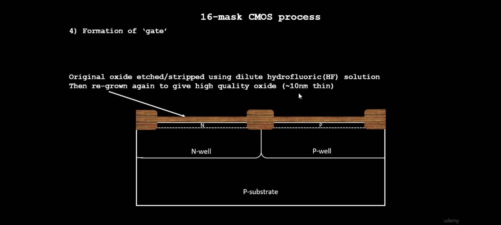
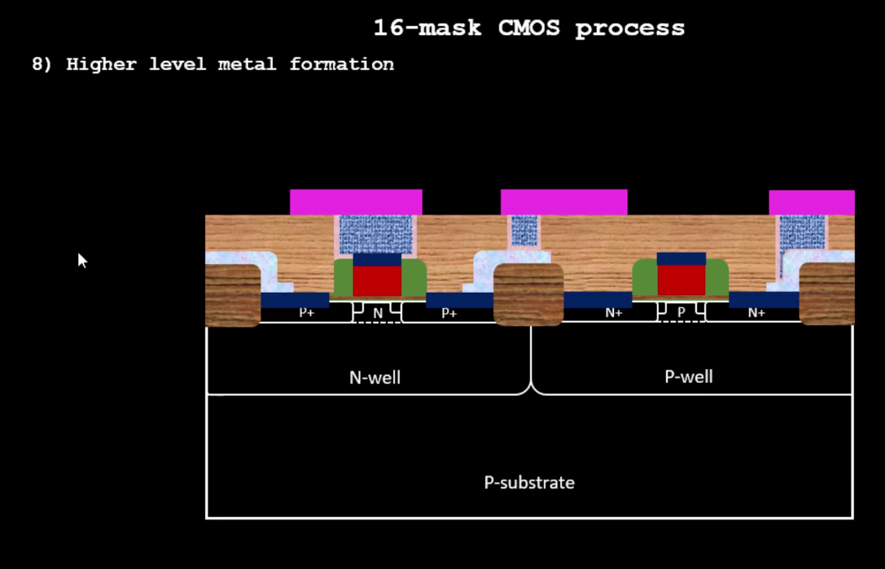

# Fabrication 

Welcome to the documentation on fabrication processes! This document provides an overview of the fabrication process, various steps involved, and specifically delves into the 16-nm CMOS fabrication process. In this section, we will see the principles of Fabrication, various processes involved in fabrication. And, especially, we will be focusing on 16-mask CMOS fabrication process.

### Table of Contents

1. [Introduction to Fabrication](#intro)
2. [Fabrication Process Overview](#fabrication-process-overview)
3. [16-nm CMOS Fabrication](#16-nm-cmos-fabrication)
4. [Conclusion](#conclusion)

---

 

---

### Introduction to Fabrication

---

Fabrication in VLSI (Very Large Scale Integration) refers to the process of manufacturing integrated circuits (ICs) on a semiconductor substrate, typically made of silicon. This process involves a series of intricate steps to create the complex structures and circuitry that constitute modern electronic devices.  The goal of VLSI fabrication is to create integrated circuits with high precision, reliability, and performance while maximizing yield and minimizing costs. This process is performed in specialized facilities called semiconductor fabs, which are equipped with advanced tools and clean room environments to ensure the highest level of quality control and precision.

Let’s see some of the techniques used in the process of fabrication.

 

---
### Fabrication Process Overview
---
 There are different processes and principles or methods involved in Fabrication process. Here, we will see all the principles and methods involved in fabrication one-by-one.
## Wafer Preparation:
Wafer preparation is a critical stage in the fabrication of integrated circuits, laying the foundation for subsequent processing steps.
Wafers are made of semiconductor material, mostly the silicon. For wafer preparation, first of all the silicon is heated upto a huge temperature and formed as  a rod shape, known as “Si Ingot”. 

Then this silicon ingot is sliced into the wafers, using various techniques. All this process of making ingot will goes on in a separate furnace, to maintain a huge temperature at a constant rate.
 After the formation of wafers, it begins with incoming wafer inspection to ensure high quality, followed by thorough cleaning to remove contaminants and particles.  
We can get a hundreds of chips from a single wafer.

  

## Photolithography:
Photolithography is a fundamental process in VLSI (Very Large Scale Integration) fabrication that is used to transfer intricate patterns onto a semiconductor substrate, typically made of silicon. This process enables the creation of complex structures and circuitry at a microscopic scale, forming the basis of integrated circuits (ICs).   
Here's how photolithography works:

  

- Photoresist Coating:  
The process begins with coating the semiconductor substrate with a thin layer of photoresist material. Photoresist is a light-sensitive polymer that changes its chemical properties when exposed to light.

 

- Mask Alignment:  
 A photomask, also known as a reticle, containing the desired circuit patterns is aligned with the coated substrate. The photomask consists of transparent and opaque regions that define the features to be patterned on the substrate.

 

- Exposure: 
  The substrate and photomask are exposed to ultraviolet (UV) light through a process called exposure.
The UV light passes through the transparent regions of the photomask, creating a pattern of light on the photoresist-coated substrate. When exposed to UV light, the photoresist undergoes a chemical reaction, either becoming more soluble (positive photoresist) or less soluble (negative photoresist) in a developing solution, depending on the type of photoresist used. Then substrate is immersed in a developing solution that selectively removes the exposed or unexposed regions of the photoresist, depending on the type of photoresist used.

 

- Etching :  
 Etching involves selectively removing material from the substrate using chemical or plasma processes.

 

- Resist Stripping: 
  Once the desired pattern has been transferred to the substrate, the remaining photoresist is removed from the surface through a process called resist stripping, leaving behind the patterned features.

 

Photolithography is a highly precise and repeatable process that allows for the creation of intricate structures and circuitry on semiconductor substrates, enabling the fabrication of advanced integrated circuits used in a wide range of electronic devices.

## Doping:

Doping is a crucial process in semiconductor fabrication, including VLSI (Very Large Scale Integration), aimed at modifying the electrical properties of semiconductor materials. In doping, impurity atoms, known as dopants, are intentionally introduced into the semiconductor substrate to alter its conductivity and control the behavior of charge carriers (electrons and holes). 

Dopants are introduced into the semiconductor substrate using one of two primary methods: ion implantation or diffusion. In ion implantation, dopant ions are accelerated to high energies and then implanted into the substrate, where they come to rest at a controlled depth. In diffusion, dopant atoms are introduced to the surface of the substrate and allowed to diffuse into the material at elevated temperatures.

## Etching:

Etching is a process in fabrication, essential for selectively removing material from semiconductor substrates to define intricate patterns and structures. This process enables the creation of various semiconductor devices, including transistors, interconnects, and capacitors, by precisely shaping the semiconductor material. There are two primary types of etching techniques employed in VLSI fabrication: wet etching and dry etching. Wet etching involves immersing the substrate in a liquid etchant solution that selectively dissolves the exposed regions of the substrate. Dry etching, on the other hand, utilizes reactive gases in a plasma state to chemically react with and remove material from the substrate surface. Dry etching techniques, such as reactive ion etching (RIE) and plasma etching, offer higher etching rates, better control over etching profiles, and greater selectivity compared to wet etching. 

These etching processes play a crucial role in defining the geometries and dimensions of semiconductor devices, enabling the fabrication of integrated circuits with high performance and functionality. 

## Ion Implantation:

Ion implantation is a process used in semiconductor fabrication to introduce dopant ions into a semiconductor substrate with high precision. In this technique, dopant ions are accelerated to high energies and then implanted into the surface of the semiconductor material. The implanted ions penetrate the substrate and come to rest at controlled depths, determined by the implantation energy and the characteristics of the semiconductor material 
Below diagram shows the mechanism or the technique of Ion Implantation.

After the dopants have been selected, the dopant ions are generated in an ion source and then accelerated to high energies, often in the range of tens to hundreds of kilovolts, before passing through a beamline for mass separation. This step ensures that only ions of the desired dopant species reach the semiconductor substrate, ensuring high doping precision and preventing contamination. Within the implantation chamber, the substrate is carefully positioned and held at controlled temperatures as the dopant ions bombard its surface. The high-energy ions penetrate the substrate's surface and come to rest at predetermined depths, determined by the implantation energy and the properties of the semiconductor material. Control over the dose (number of implanted ions per unit area) and energy of the ion beam is critical for achieving the desired doping concentration and profile within the substrate.

## Deposition:

Deposition in fabrication refers to the process of adding thin layers of material onto a substrate surface, which is typically a semiconductor wafer, to create essential structures and components for semiconductor devices. This process is integral to VLSI (Very Large Scale Integration) fabrication, enabling the formation of layers with specific properties such as insulators, conductors, and semiconductors. Various deposition techniques are employed in semiconductor fabrication, each suited to depositing different types of materials.

There are different types of deposition techniques as mentioned below:

- Chemical Vapor Deposition (CVD):  It involves the introduction of precursor gases into a chamber where they react to form thin films on the substrate surface. 

- Physical Vapor Deposition (PVD):  It involves the physical evaporation or sputtering of material from a solid source onto the substrate.

- Atomic Layer Deposition (ALD):  It allows for the precise deposition of atomic layers using alternating pulses of precursor gases. 

- Epitaxial deposition:  It involves growing crystalline layers of semiconductor material on a substrate with a similar crystal structure, essential for creating specific doping profiles and crystalline orientations in semiconductor devices. 

By controlling deposition parameters, engineers can tailor the properties of deposited layers to meet the requirements of specific semiconductor components, such as gate oxides, interconnects, metal contacts, and dielectric layers. 

## Annealing:

Annealing, a critical process in semiconductor fabrication, involves controlled heating and cooling to modify the structural and electrical properties of semiconductor materials. It serves several key purposes in VLSI (Very Large Scale Integration) fabrication. Firstly, annealing activates dopants introduced into the semiconductor substrate through processes like ion implantation or diffusion. By incorporating dopants into the semiconductor lattice and repairing crystal damage, activation annealing ensures that dopants contribute to desired electrical properties. Secondly, annealing reduces crystalline defects and imperfections, such as vacancies and dislocations, by allowing atoms to rearrange within the crystal lattice. This process improves structural integrity and reduces the risk of mechanical failure. 

Additionally, annealing relieves stress in semiconductor materials caused by thermal expansion mismatches or processing steps, contributing to device reliability. 

## Metallization:

Metallization in fabrication is a key process involved in creating interconnections within integrated circuits (ICs). It entails depositing metal layers onto a semiconductor substrate, allowing for the routing of signals and power throughout the device. Initially, metal layers are deposited onto the substrate using techniques like physical or chemical vapor deposition, employing metals such as aluminum, copper, or tungsten for their conductivity and compatibility with semiconductor processing. Subsequently, these metal layers undergo patterning via photolithography and etching to define the desired interconnect patterns. To insulate and isolate metal interconnects, dielectric layers made of materials like silicon dioxide or silicon nitride are deposited onto the patterned metal layers. Vias, or vertical interconnect access holes, are then formed in the dielectric layer to enable vertical connections between different metal layers. Multiple metal layers may be stacked on top of each other, separated by dielectric layers, to create complex interconnect structures. 

After metallization, planarization processes such as chemical-mechanical polishing ensure surface uniformity and enhance the reliability of metal interconnects.  
In this process, the upper layer metal connections, should be wider than the below ones, to reduce the resistance, and increae the driving capability of the nets.

## Testing and Packaging:

Testing and packaging are critical stages in semiconductor fabrication, ensuring the functionality, reliability, and durability of integrated circuits (ICs) before they are deployed in electronic devices.
During testing, fabricated ICs undergo rigorous examination to identify any defects or faults in their operation. This process involves subjecting the ICs to various electrical tests, such as functional testing, parametric testing, and reliability testing, to ensure that they meet the specifications and performance requirements. Functional testing verifies that the IC performs its intended functions correctly, while parametric testing evaluates its electrical characteristics within specified tolerances. Reliability testing assesses the IC's long-term performance under stress conditions, such as temperature cycling, voltage variations, and accelerated aging, to predict its lifespan and ensure robustness.

Following testing, ICs are packaged to protect them from environmental factors, provide electrical connections, and facilitate integration into electronic systems. Packaging involves encapsulating the IC in a protective enclosure, typically made of plastic or ceramic, and attaching external leads or terminals for connectivity.

Then we will get our final chip ready....!

  
---

### 16-nm CMOS Fabrication
---
In the realm of semiconductor manufacturing, the 16-mask CMOS (Complementary Metal-Oxide-Semiconductor) fabrication process stands out as a sophisticated method for crafting integrated circuits with high performance and efficiency. This process involves a series of intricate steps, each controlled by precise patterning using 16 different masks. Below, we delve into the sequential stages of this fabrication process and below, we can see the images for the every phase of fabrication process:
Initially the Si Ingots are manufactured from the Silicon, and then, wafers are extracted from these Si Ingots. These silicon wafers are either of the substrates, that is p-type or n-type.
 
And then we have to select a substrate for the furthur process.
And the substrate should have high resistivity and the doping concentration   of the substrate should be less than the doping concentration of the well which will be formed later.

Now on the substrate, a layer of SiO2(of thickness 40nm) is formed and on this layer, 80nm of Si3N4 layer is formed. And now, the process of Photolithography is started. And as a part of Photolithography, A layer of photoresist is formed above these layers.

Now the mask1 come into action, and for creating active region for the transistors, mask 1 is placed above the photoresist layer. These masks are used to create patterns on the layer according to the layout. Now a beam of UV light is focused on the mask 1.

Now, the photoresist which is not covered with the mask 1 is removed due to UV light.

Now the mask 1 is removed and the Si3N4   is removed through a chemical process. But the  Si3N4 under the photoresist is etched away through the process of etching.

Now the photoresist is removed by the process of chemical stripping.
Chemical stripping involves immersing the wafer in a solution that dissolves the photoresist material. Commonly used chemicals for this purpose include sulfuric acid, hydrogen peroxide, and deionized water mixtures (known as piranha solution) or organic solvents like acetone, methyl ethyl ketone (MEK), or N-methyl-2-pyrrolidone (NMP).
The choice of chemical depends on factors such as the type of photoresist used and the compatibility with the underlying materials on the wafer.

Now, the above setup is placed inside an oxidation furnace. And as a result of this process, field oxide is grown, and this process is called LOCOS or Local Oxidation of Silicon. The oxide is grown at the regions where it is not covered by Si3N4 layer, and it forms a structure known as Bird’s Beak.

Now, the Si3N4  is removed or stripped by the hot phosphoric acid and again a layer of phottoresist is formed on the oxide.

With this, the phase for the formation of n-well and p-well regions is started. And now, the mask – 2 is placed on the photoresist, as shown below to create the wells. And again the UV beam is made to fall on the mask and photoresist.

Now, the photoresist which is not covered with mask is removed. And now, the process of forming the wells is started. And Boron ions are implanted on the substrate through the process of Ion Implantation with an energy  of 200eV for the boron ions to penetrate into the substrate crossing the Silicon oxide layer. Now, the p-well is formed.

Now, the photoresist is stripped away. And agian a phototresist layer is formed on the oxide layer, and the mask 3 is placed on the photoresist.
And again, same process is followed, that is the UV beam id made to fall on the phototresist, and the photoresist is removed.

Similarly, phosphorus ions are implanted into the substrate with a high energy through the process of Ion Implantation.And as a result of this process, n-well is created.
Now, the setup is placed in a high temperature furnace. 

Due to the high temperature, the n-well and p-well regions are expanded and penetrated deep into the substrate.

For the gate formation, the threshold voltage and oxide capacitance is considered as per the properties mentioned below:

Now for the formation og gate, again the photoresist is formed on the oxide layer.and then mask-4nis placed on phototresist and again the photoresist not covered with mask 4 is removed by the UV light.

Now, Boron ions are implanted into the substrate but with some little energy, so that they will form nearer to the silicon oxide. Now, the p region is created. Similarly, the n region is also created with phosphorus or Arsenic.
After that the mask and photoresist are stripped, and the oxide ayer is stripped using Hydro flouric solution, and again a new layer of oxide is formed to maintain the oxide quality.

Now, polysilicon layer of thickness 0.4um is formed on the oxide layer for the formation of gate. And then, n-type ions are implanted on the polysilicon layer to maintain the low gate resistance.

Now, again the photoresist is formed on the polysilicon layer and mask 6 is placed on the photoresist. And the photoresist which is not covered with the mask, is etched away. And, then we get as shown below.

Now, the mask is removed and then the polysislicon is exposed to a plasma containing reactive gases, typically fluorine-based, within a vacuum chamber. These gases react with the polysilicon, forming volatile byproducts that are removed from the surface, effectively etching the polysilicon layer.

Now, the photoresist is removed chemically.

Now, Lightly doped drain formation will takes place, as it is used to address the isssues like Hot  electron effect and Short channel effect. 
Let’s see what are these effects...

- Hot Electron Effect:  The hot electron effect is a notable phenomenon observed in semiconductor devices, particularly in Metal-Oxide-Semiconductor Field-Effect Transistors (MOSFETs). It arises when electrons within the device gain kinetic energy from high electric fields, especially near the drain terminal. As a consequence, these high-energy electrons can induce damage to the device, leading to issues such as gate oxide degradation, interface state generation, threshold voltage shifts, and increased leakage currents. The impact of the hot electron effect becomes more pronounced as device dimensions shrink and operating voltages increase.  
Lightly doped drain (LDD) structures serve as an effective solution to mitigate the adverse effects of the hot electron effect in MOSFETs.  
LDD structures help to reduce the electric field strength near the drain terminal, where hot electron generation typically occurs. This reduction in electric field strength diminishes the energy imparted to electrons traveling towards the drain, thereby lowering the likelihood of high-energy electrons causing damage to the gate oxide or interface.  

- Short Channel Effect: The short-channel effect is a phenomenon that occurs in Metal-Oxide-Semiconductor Field-Effect Transistors (MOSFETs) as their channel lengths decrease. It refers to several unwanted behaviours that arise when the channel length of a MOSFET becomes comparable to or smaller than the depletion layer width of the source and drain regions.  
Lightly doped drain (LDD) structures are implemented in MOSFET fabrication to counteract the short-channel effect, offering several key advantages. By incorporating a lightly doped region between the channel and the heavily doped drain, LDD structures effectively extend the effective channel length. This extension mitigates the drain-induced barrier lowering (DIBL) effect, reducing variations in the threshold voltage and improving device performance reliability. 

Now, the photoresist layer is formed again on the oxide layer. Now, mask 7 is placed on the photoresist, and photoresist is etched where it is not covered with the mask. Then, mask 7 is removed, and a beam of phosphorous ions is implanted into the substrate  to form n – implants.
Similarly, the process will repeat and the p-implants are also formed using mask 8.
And then a layer of Si3N4 , is formed on the oxide layer.

Now, Plasma anisotropic etching will takes place.
Plasma anisotropic etching is a key process used in semiconductor fabrication for precisely etching materials with high selectivity and control. "Anisotropic" refers to the directionality of the etching, meaning that the etch rate varies depending on the orientation of the material's crystal structure. In plasma anisotropic etching, a plasma composed of reactive gases is used to selectively remove material from a substrate. The plasma contains chemically reactive species, such as ions and radicals, that react with the material being etched. 
Plasma anisotropic etching is often used in conjunction with masking techniques.

As a result of Plasma anisotropic etching, the Si3N4 , is removed expect at the locations, adjacent to Polysilicon material.
And the Si3N4, present on the adjacent sides of the Polysilicon are knoen as Side-wall Spacers.

Now, a thin oxide layer is formed on the surface as shown below to avoid the channelling during implants.

Now, using mask 9 and mask 10, the Source and Drain are formed. During this process, Ion implantation process takes place with a less amount of energy of around 70 eV, and the source and drain are formed.

Now, the process, High temperature annealing will takes place. 
High-temperature annealing is a process used in semiconductor fabrication to modify the properties of materials through heat treatment at elevated temperatures. Annealing involves heating a material to a specific temperature and holding it at that temperature for a certain duration, followed by controlled cooling. High-temperature annealing typically refers to annealing processes conducted at temperatures above 600°C, although exact temperatures can vary depending on the materials and desired outcomes. Generally, Ion implantation is commonly used to introduce dopants into semiconductor materials. However, this process can also introduce damage to the crystal lattice. High-temperature annealing helps to repair this damage and activate the implanted dopants, ensuring proper device functionality. 

Now, the thin oxide layer formed all over the surface is etched in Hydro Flouric solution.

The wafer is heated at about 650 to 700 C in N2  ambient for 60 sec. And then, as a result of this heating process, TiN layer is formed all over the wafer surface. This TiN is used for the purpose of local communication. 
TiN possesses excellent electrical conductivity, thermal stability, and chemical inertness, making it highly suitable for interconnect applications. Secondly, TiN serves as an effective barrier layer between different metal layers and the underlying semiconductor substrate, preventing diffusion and maintaining device integrity. Its low resistivity compared to alternative barrier materials ensures efficient signal transmission and minimal voltage drop across the interconnects, contributing to enhanced device performance. The use of TiN interconnects helps reduce the resistance-capacitance (RC) delay in ICs, resulting in faster signal propagation and improved overall device performance. These attributes collectively make TiN a crucial component in the development of high-performance and reliable semiconductor devices. 

Now, the mask 11 is used to form the below pattern which includes formation of photoresist, placing the mask, etching of photoresist.

Now, the mask is removed, and the TiN layer is removed/stripped/etched using RCA Cleaning technique.
RCA cleaning, a vital process in semiconductor fabrication, involves a series of chemical cleaning steps aimed at removing organic and inorganic contaminants from silicon wafers. Consisting of RCA-1 and RCA-2 steps, this method effectively cleanses wafers prior to subsequent processing stages like oxidation and deposition. In RCA-1, a mixture of ammonium hydroxide (NH4OH), hydrogen peroxide (H2O2), and deionized water eliminates organic residues, while RCA-2 employs hydrochloric acid (HCl), hydrogen peroxide (H2O2), and deionized water to eradicate metallic impurities. These solutions act respectively as bases and acids, supported by oxidizing agents, to dissolve contaminants. Thorough rinsing with deionized water completes the process, ensuring a pristine substrate surface. Widely adopted in semiconductor facilities, RCA cleaning maintains silicon wafer purity, facilitating high-quality device fabrication and enhancing overall manufacturing reliability 

Now, the phase of higher level metal formation will starts. And now, the photoresist is etched away. Now, 1um of Silicon dioxide with phosphorous or boron which is usually known as phosphosilicate glass or borophosphosilicate glass is deposited on the wafer surface.

The wafer surface is planerized using the Chemical mechanical polishing(CMP) technique. 
Chemical mechanical polishing (CMP) is a key process in semiconductor fabrication aimed at planarizing and polishing silicon wafer surfaces. This technique involves the simultaneous application of chemical and mechanical forces to remove surface irregularities and achieve high flatness and smoothness. CMP finds extensive use in semiconductor fabrication for planarizing interlayer dielectrics and metal layers, smoothing silicon wafer surfaces, removing surface damage, and achieving uniformity essential for advanced semiconductor device fabrication. 

Now, by using mask 12, the patterns as mentioned below are formed.

Now, the portion of  phosphosilicate glass is etched away and the mask is removed and then a layer of TiN is formed on the wafer surface.

Now, the blanket of tungsten layer is deposited on the wafer surface and again the 
Chemical mechanical polishing technique is used to to planarize the surface.

Now, a layer of Aluminium is deposited on the surface to make the metal connections, with the drain source and gate regions.
And after that, the photoresist is formed on the surface, and then using the mask 13, we will make the first level of interconnect of the aluminium.

Now, again a layer of Silicon dioxide is deposited on the wafer surface and the surface is again planerized by the chemical mechanical polishing.

Now, the mask 14 is used to define the contact holes with the aluninium. After defining contact holes, a layer of TiN is deposited on the wafer surface at the region of contact holes. And, then a lyer of Tungsten is formed on the wafer surface, and CMP will takes place to make the Tungsten interconnection with the contact holes that is with Aluminium

Now, mask 15 is used to make the second level of interconnection. Nd after forming the interconnection, it is shown as below.

Now a highly dielectric material such as Si3N4  is deposited on the wafer surface which acts as the protection barrier to the chip. And it protects the chip from external environment.

Now, we will use mask 16 to drill the contact holes, and to bring the contact outside of the chip.

We can clearly see that the upper level interconnections are must be thicker than the lower level inter connections.
After the fabrication of the chip, it is sent for testing and then packaging.

  

## Conclusion
 

In conclusion, this document has provided a detailed overview of fabrication processes in semiconductor manufacturing, with a specific focus on the 16-nm CMOS fabrication process. We've explored the intricate steps involved in transforming semiconductor materials into functional devices, highlighting the significance of fabrication techniques in modern electronics.

Throughout our exploration, we've witnessed the evolution of semiconductor manufacturing, driven by advancements in technology, materials, and methodologies. From the early days of photolithography to the sophisticated processes employed in current CMOS fabrication, the semiconductor industry has continually pushed the boundaries of innovation to meet the demands of an ever-evolving market.

Looking ahead, the future of fabrication processes holds immense promise, with emerging technologies such as nanotechnology, 3D printing, and advanced materials poised to revolutionize semiconductor manufacturing. By embracing these innovations and fostering collaboration across interdisciplinary fields, we can unlock new opportunities and address the challenges of tomorrow.

---

