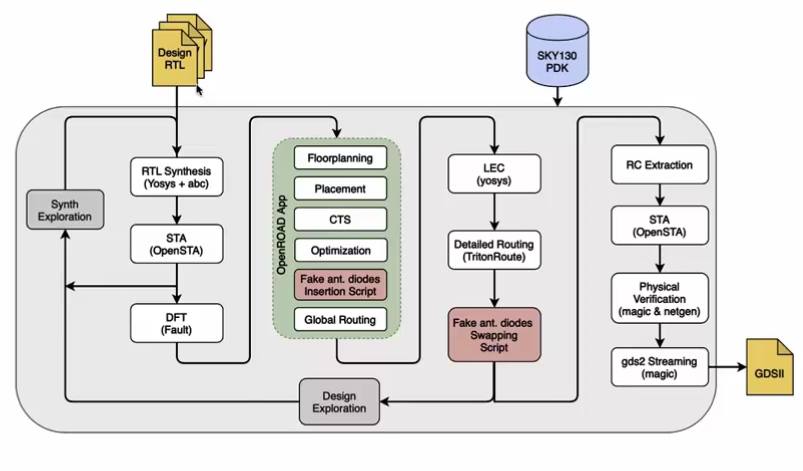

## Opensource ASIC design Flow:

Welcome to the world of open-source ASIC design! This document serves as a comprehensive introduction to OpenLane, Google SkyWater 130nm Process Design Kits (PDKs), and the broader ecosystem of open-source ASIC design. In recent years, there has been a growing interest in democratizing chip design by making it accessible to a broader audience through open-source tools and technologies. OpenLane, an automated RTL-to-GDSII flow developed by efabless and Google SkyWater Technology Foundry, is at the forefront of this movement, offering a complete open-source solution for ASIC design. Coupled with the availability of Google SkyWater's 130nm PDKs, which provide access to a mature semiconductor process node, open-source ASIC design has become more accessible and viable than ever before. In this document, we'll explore the principles, capabilities, and advantages of OpenLane and Google SkyWater 130nm PDKs, as well as the broader implications of open-source ASIC design for the semiconductor industry and beyond

## Table of Contents

1. [Introduction to Openlane](#introduction)
2. [What is a Processor?](#processor)
4. [What is a Package?](#package)
5. [Introduction RISC-V Architecture](#risc)
6. [Flow of System Software](#system)
7. [System on Chip design](#soc)
8. [Digital ASIC design](#asic)
9. [Introduction to Google Skywater 130nm PDKs](#skywater)
10. [Introduction to Strive SOC family](#strive)
11. [Openlane Flow](#openlane)
12. [File formats in Openlane Flow](#file)
13. [Conclusion](#conclusion)

# Introduction to Openlane
-----------------------

 OpenLane, an automated RTL-to-GDSII flow developed by efabless and Google SkyWater Technology Foundry, is at the forefront of this movement, offering a complete open-source solution for ASIC design.

### Chip:
 Generally, A computer chip is a tiny wafer of semiconducting material with an embedded  electronic circuit. It contains millions of microscopic electronic components called transistors that transmit data signals

### Processor: 

A computer processor, also known as a Central Processing Unit (CPU), is the primary component of a computer responsible for executing instructions and performing calculations. It acts as the brain of the computer, processing data and managing the flow of information within the system. 

- ### Instruction Execution:
   The primary role of a computer processor, or CPU (Central Processing Unit), is to execute instructions stored in the computer's memory. These instructions dictate the operations the CPU needs to perform, such as arithmetic calculations, logic operations, data movement, and control operations. 

- ### Arithmetic and logic operations:
   A crucial function of the CPU is to perform arithmetic and logic operations on data. Arithmetic operations include addition, subtraction, multiplication, and division, while logic operations involve fundamental logical functions such as AND, OR, and NOT. These operations are essential for manipulating and processing data according to the requirements of software programs running on the computer.

- ### Control of Data Flow: 
  The CPU controls the flow of data within the computer system. It manages the movement of data between various components, including memory, input/output devices, and different parts of the CPU itself. This involves coordinating data transfers, ensuring data integrity, and optimizing data pathways to minimize delays and maximize system performance. 

- ### Fetching and Decoding Instructions : 
  The CPU fetches instructions from the computer's memory, decodes them to determine their meaning and the operations they require, and then executes them accordingly. This process occurs continuously as the CPU cycles through the instructions provided by the running software programs.
  
    

  

  

Every processor follows certain protocols to communicate with peripherals.

 

## Package:

A "package" refers to the physical container or housing that holds and protects an integrated circuit (IC) chip. The package provides mechanical support, electrical connections, and thermal management for the chip. It also serves as a medium for interfacing the chip with the outside world, allowing it to connect to a printed circuit board (PCB) or other components in an electronic system.
The package typically consists of several layers, including a substrate, wire bonds or solder balls for electrical connections, encapsulation materials for protection, and external leads or pins for connection to the PCB.   
Now, let’s see the how a package looks like. In this case, we will learn about QFN-48 package.

  

A package is like protection to a chip or integrated chip integrated in it.

 

 

In this case, QFN-48, there are various parts inside it,that is embedded in it

 

 

There are different things embedded in it like, wire bonds, pads, Foundary IP’s, Macros, Die.
Let’s see there functionalities and purpose inside it.

### Wire bonds:
"wire bonds" are the conductive wires used to establish electrical connections between the integrated circuit (IC) chip and the leads or pads of the package. This process is crucial for enabling the IC to communicate with external components and systems.  
Wire bonding is accomplished using specialized equipment that thermally and mechanically bonds the wire to the bonding pads on the IC chip and the package substrate. This bonding process often involves applying heat, pressure, and ultrasonic energy to form a secure connection.

 

 

### Pads:

 Pads refer to the metalized areas on the surface of the package substrate or the integrated circuit (IC) chip where electrical connections are made. These pads serve as points of contact for establishing connections between the IC chip and external components.

 

### Foundary IP’s :
 "Foundry IPs" (Intellectual Properties) refer to pre-designed and pre-verified functional blocks or components provided by semiconductor foundries for use in integrated circuit (IC) designs. 

 

These are some of the typical parts of a chip. A typical chip also contains below parts as shown below:

 

 

We can see a RISC V SOC in the above typical chip. A RISC-V System-on-Chip (SoC) integrates multiple components onto a single chip to provide computational power, memory resources, and I/O capabilities for diverse applications. Let’s know more about RISC-V.

 

## RISC-V Architecture:

RISC-V, an open-source Instruction Set Architecture (ISA), has emerged as a pivotal role in the realm of computer architecture due to its significance and versatility. 
Functionally, RISC-V consists of teh various principles of Reduced Set Instruction Set Computing.
It emphasizes simplicity, efficiency and scalability. It’s modular architecture allows for the seamless integration of custom extensions.
 
Nowadays, most of the processor designs are based on the RISC-V Instruction Set Architecture(ISA).

### ISA:
Instruction Set Architecture (ISA) is like the rulebook for a computer's brain. It defines the set of instructions that a processor can understand and execute. These instructions tell the processor what tasks to perform. 
Different processors can have different ISAs  The ISA plays a crucial role in determining the capabilities and performance of a computer system. 

 

 

Let’s know how the RISC-V architecture flow goes on.
First the user will give the C language in C/C++ language. As we know the computer is unable to understand it, so, first the C language is compiled in it’s assembly language, which is also known as the RISC-V assembly language. And then it is converted to Machine language which was able to understand by the computer. 

There is an interface between RISC-V and its layout that is known as HDL(Hardware Description Language). Through the HDL we can directly communicate with the hardware. The Hardware Description language is commmonly written in Verilog or VHDL.

 

 

This RISC-V is implemented in RTL and then converted into layout through physical implementation

 

 

## Flow of System Software:

Any software communicates with hardware through a structured process facilitated by the operating system (OS) and device drivers.
Through system calls or application programming interfaces (APIs), software applications communicate with the OS, which in turn interacts with device drivers. These device drivers serve as intermediaries between the OS and specific hardware devices, offering a standardized interface while abstracting the intricacies of hardware operations. 
In this way any software communicates with hardware. In this flow, specific operations related to hardware is written in C/C++and then compiled and then for the understanding purpose for the computer, it is converted into 0’s and 1’s. This digital bit stream can easily communicate with the hardware that is mapped into hardware through the interface HDL.

 

 

 

So, in overall, the Instruction set Architecture is fed to the assembler through RISC-V assembly language, and then RTL i.e., the hardware description language is written, and from that, a netlist is synthesized. The synthesized netlist is then converted into Physical layout which is converted into hardware through various kinds of step.

 

 

## SOC: 

"SOC" stands for System on a Chip. It refers to an integrated circuit (IC) that incorporates most or all components of a computer or other electronic system onto a single chip. These components typically include a central processing unit (CPU), memory, input/output ports, and various other peripherals necessary for the device's operation. SoC designs are common in smartphones, tablets, wearable devices, and other compact electronics where space and power efficiency are crucial.

 

 

## SOC Design Flow:

As the name suggests, iit is like building a complete system onto a single chip.  The main components of an SoC typically include a central processing unit, memory, input and output ports, peripheral interfaces and secondary storage devices. 

A typical SOC consists of following parts.

 

 

## Digital ASIC Design Flow:

Digital ASIC (Application-Specific Integrated Circuit) design is a specialized process that involves creating custom integrated circuits optimized for particular applications. 

In practical digital ASIC design, three key components play crucial roles: RTL IP's (Register Transfer Level Intellectual Properties), Electronic Design Automation (EDA) tools, and Process Design Kits (PDK). 

 
    

 

### RTL IP’s(Register Transfer Level Intellectual Properties):
RTL IP's are pre-designed, reusable functional blocks or modules at the register-transfer level of abstraction. 
These IP's can include components such as processors, memory controllers, interface modules, and specialized accelerators. 
They serve as building blocks for ASIC designs, enabling designers to integrate complex functionality into their designs efficiently.

### EDA Tools(Electronic Design Automation):
EDA tools are software applications used throughout the ASIC design process to design, simulate, verify, and analyze integrated circuits. 
These tools include a wide range of functionalities, such as logic synthesis, simulation, timing analysis, place and route, and physical verification. 

### PDK(Process Design Kit):
A Process Design Kit (PDK) is a collection of files, models, and documentation provided by semiconductor manufacturers to support the design of integrated circuits using their fabrication processes. 
It includes information about the semiconductor process technology, such as transistor models, design rules, layout constraints, and technology files. 
Designers use the PDK to ensure that their ASIC designs are compatible with the manufacturing process and to optimize their designs for performance, power, and reliability. 
PDK ia like an interface between Designs and Fab units.
It is a collection of files used to model a fabrication process.

 

## Introduction to Google Skywater 130nm Technology:

The Open Source Google Skywater PDK (Process Design Kit) is a  initiative is aimed at improving semiconductor chip design by offering free and open access to a set of tools and resources. It is dveloped in collaboration with Skywater Technology Foundry. This PDK is based on the 130nm process node and provides designers with essential components such as design rules, device models, standard cell libraries, and memory compilers necessary for ASIC and custom chip design. It is released under the Apache 2.0 license. It is freely available for use, modification, and distribution, fostering collaboration and innovation within the semiconductor design community. 

 

 

The "130nm" designation refers to the minimum feature size achievable using this process, measured in nano meters. In this case, it means that the process is capable of fabricating structures as small as 130 nano meters. Since, 130nm technology, is not present now, It is improved more and more below 10nm also.

 

## Introduction to Strive SOC Family and Openlane:

Strive is a family which provides OPEN everything. It includes, Open RTL, Open EDA and Open PDK.

 

 

 

## Openlane:

OpenLANE is an open-source ASIC design flow that provides a complete RTL-to-GDSII (Register Transfer Level to Graphic Design System II) flow for digital ASIC designs. 

It can go with easy flow, without any human intervention, this Opensource flow, is tuned by google Skywater 130nm Open PDK.

Openlane flow has two modes of operations:
- Interactive mode
- Autonomous mode

 

- ### Interactive mode of operation:
  Openlane offers an interactive mode of operation that enables users to interactively explore and customize various aspects of the ASIC design flow. In this mode, designers have the flexibility to fine-tune parameters, make design decisions, and iterate on the design process in real-time. The interactive mode provides a user-friendly interface where designers can input design specifications, constraints, and preferences, guiding the Openlane flow accordingly. Designers can adjust synthesis options, floorplan settings, placement constraints, routing parameters, and other design parameters to optimize the ASIC design for performance, power, and area. The interactive mode also facilitates visualization of design results, allowing designers to inspect floorplans, placement layouts, routing details, and timing analysis reports.

 

- ### Autonomous mode of operation:
  Autonomous mode of operation in Openlane represents a significant advancement in ASIC design automation, streamlining the design process and reducing the need for manual intervention. In this mode, Openlane operates without direct user interaction, leveraging predefined design configurations and optimization strategies to guide the entire RTL-to-GDSII flow autonomously. Designers input design specifications and constraints upfront, and Openlane autonomously executes each step of the ASIC design flow, from synthesis to physical verification, without requiring manual intervention at each stage. By automating repetitive tasks and decision-making processes, autonomous mode significantly accelerates the design process, reduces human error, and enhances overall productivity. 

In openlane, we can find best set of Flow configurations. We can also find some design examples in openlane with best configurations.

 

## Openlane Design Flow:

The Openlane design flow offers a comprehensive and open-source solution for the entire process of creating Application-Specific Integrated Circuits (ASICs), from Register Transfer Level (RTL) design to generating the final Graphic Design System II (GDSII) layout. It is developed by efabless and Google Skywater PDK collaborators.

 

 

In Openlane flow, we will give RTL i.e hardware description and Sky130 Process Design Kit as input and after a series of processes, we will get our final GDSII as output.
In this flow, there are different steps and performed by different tools.
OpenLANE integrates various tools and utilities to automate the ASIC design flow efficiently. 

- ### YOSYS:
  Converts RTL (Register Transfer Level) code into a gate-level netlist using synthesis techniques. It also performs Logic Equivalence Checking(LEC). In ASIC Design flow, we perform verification at different stages. At whenever the netlist is modified, we have to perform the verification that formally confirm that the functionality is not changed after the modification.

- ### ABC: 
  It is a synthesis and verification tool. Maps synthesized logic into target technology libraries, optimizing for area, power, and timing. It performs technology mapping

- ### OPENSTA: 
  Analyzes the timing characteristics of the ASIC design, ensuring that signals propagate within specified timing constraints. Performs Static timing analysis

- ### OPENROAD: 
  Performs floorplanning to define the physical layout of the ASIC, placement of logic cells within the floorplan, and routing of interconnections between the cells and Clock tree synthesis. It is involved mostly in Physical implementation of ASIC design flow.

- ### MAGIC: 
  Allows designers to view, edit, and manipulate the physical layout of the ASIC design in GDSII format. Also used for performing additional physical verification checks such as Design Rule Check (DRC). It is used for various purposes like, RC extraction and LVS(Layout Vs Schematic)

- ### NETGEN: 
  Compares the layout of the ASIC design with its corresponding schematic to ensure they match accurately. It performs LVS(Layout Vs Schematic).

- ### FAULT: 
  Detects and analyzes faults or defects in the ASIC design layout to ensure reliability and robustness. It performs DFT(Design Foe Test).

- ### K LAYOUT: 
  Provides a graphical interface for viewing and inspecting the physical layout of the ASIC design. 

 

## Design exploration in Openlane:
Design exploration in the Openlane flow refers to the process of systematically exploring and analyzing different design configurations to achieve optimal performance, power, and area trade-offs for an ASIC design. 
 
It is used to  sweep design configurations.
We have different design configurations in Openlane as mentioned below:

 

 

Design exporation utility can be also be used for regression testing.

 

 

## Synthesis exploration in Openlane:
Synthesis exploration in Openlane refers to the process of systematically exploring and analyzing different synthesis options and strategies to optimize the quality of the synthesized gate-level netlist. 
Different designs have different strategies to achieve design target. Synthesis exploration is used to generate the reports about the design delay.

 

 

In this ASIC design flow, we have a special process during Physical implementation. It is known as Antenna Diodes Insertion. This is requires to address teh antenna diode violations.

 

 
 

## File formats in Openlane design Flow:

- ### Verilog(.v):
  Describes the functionality of the ASIC design at the register transfer level (RTL).

- ### Synopsys design Constraints(SDC) File(. sdc): 
  Specifies timing constraints and optimization directives for synthesis, placement, and routing stages. 

- ### Library Exchange Format(LEF) File(.lef): 
  Defines the physical and electrical properties of the standard cell library used in the ASIC design 

- ### Design Exchange Format(DEF) File(.def): 
  Contains the physical layout information of the ASIC design, including cell placement and routing details. 

- ### Gate-levl-netlist(.v):
  Represents the design as a gate-level netlist after synthesis, specifying logic gates and their interconnections. 

- ### Standard Parasitic Exchange Format(SPEF) File(.spef): 
  Represents parasitic resistances and capacitances extracted from the layout of the ASIC design. 

- ### Liberty File(.lib): Contains timing and power models for 
  standard cells in the target technology library. 

- ### Tool Command Language(TCL) Script(.tcl): 
  Used to automate tasks and interact with the OpenLANE toolchain in an interactive manner. 

- ### Configuration Files(.config): 
  Openlane configuration files specify various settings and options for the design flow. 

- ### Report Files(.rpt, .log): 
  Openlane generates various report files during the design flow, containing information about synthesis results, timing analysis reports, optimization statistics, and error messages. 

- ### GDSII Layout File(.gds): 
  Represents the physical layout of the ASIC design in two-dimensional geometric shapes. 
  
 
 

These file formats cover various stages of the ASIC design flow in OpenLANE, facilitating communication between different stages, enabling automation and customization, and ensuring compatibility with the target technology and design requirements. 

---
### Conclusion
---

In conclusion, open-source ASIC design, powered by tools like OpenLane and supported by semiconductor processes like Google SkyWater 130nm PDKs, represents a significant paradigm shift in the semiconductor industry. By democratizing chip design and providing access to mature semiconductor process nodes, open-source ASIC design has empowered individuals and organizations to innovate and create custom integrated circuits tailored to their specific needs and applications.

The OpenLane flow, with its automated RTL-to-GDSII capabilities, has played a pivotal role in simplifying and streamlining the ASIC design process. By providing an end-to-end open-source solution, OpenLane has lowered the barriers to entry for ASIC design, enabling designers to focus on innovation rather than infrastructure.

Google SkyWater 130nm PDKs offer access to a mature semiconductor process node with well-characterized libraries and manufacturing capabilities. This collaboration between Google and the open-source community has provided a unique opportunity for designers to prototype and fabricate their designs at an affordable cost, further fueling the adoption of open-source ASIC design.

Looking ahead, the future of open-source ASIC design holds immense promise. With ongoing developments in tooling, process technology, and community collaboration, we can expect to see continued innovation and growth in the field. Open-source ASIC design has the potential to democratize access to custom chip design, foster greater innovation and diversity in the semiconductor industry, and drive progress in a wide range of applications, from IoT devices to specialized accelerators and beyond

