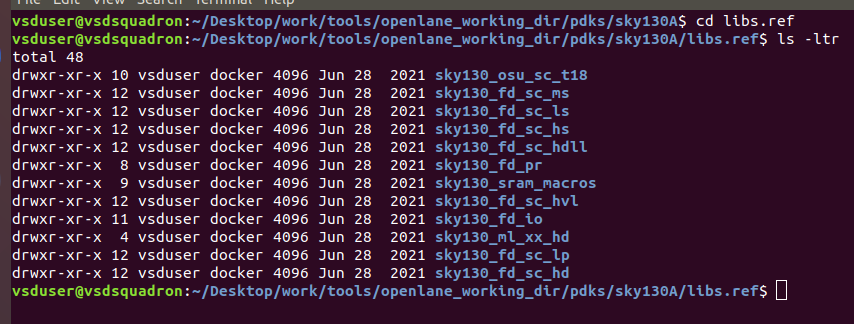

# DAY-1

# Openlane Design Flow 

------------------------

### Openlane Working Directory:

Openlane is an open-source ASIC (Application-Specific Integrated Circuit) design flow created by Efabless Corporation. It provides a complete RTL-to-GDSII (Register Transfer Level to Graphic Design System II) design flow for digital integrated circuit design. The Openlane flow integrates various open-source EDA (Electronic Design Automation) tools into a cohesive framework, allowing designers to automate the process of designing, verifying, and fabricating custom digital integrated circuits. 

Openlane flow consists of various tools. Let’s know the directory structure of openlane.
- Open Terminal
- Change the directory to openlane_working_dir
- To change the directory, run the below command.

 

 

- Openlane_working_dir consists of three sub directories.
  - pdks
  - openlane_old
  - openlane
- Now, change the directory to pdks 
- To change the directory, run the below command.

 

 

- Pdks consists of 
    - skywater-pdk
     - open_pdks
     - sky130A
  
- Open pdks are found to be compatible with Open source EDA tools.
- Now, change the directory to Sky130A.
-  For that run the below command.

 

 

- Sky130A consists of 
    - libs.tech
    - libs.ref
  -   Sources
-  ### libs.tech:
   This directory consists a list of tools available, in the openlane design flow.

 

 

- ### libs.ref : 
  This directory consists a list of Technology files.

 

 

- As shown above, this directory consists of technology files.
-  Out of these, we are going to work with sky130_fd_sc_hd

 

 

- As, we can see above, sky130_fd_sc_hd directory consists of various design related files.
- Now, navigate to various directories as shown below.

 

 

 

 

 

 

- Now, return to back to the openlane_workind_dir directory.
- Now, navigate to the openlane directory.

 

 

- This directory consists of various files related to the openlane flow like configurations, README.md and design examples and many more.
- Now, go to the designs directory.
- Here, we will see different design examples, which are already present in openlane and also some new designs are going to be added later. 
- In these examples, we are going to work with the design picorv32a.
- Navigate to the picorv32a directory.
  
 

 

 

-  Here we can see different files inlcuding confid.tcl and src.
-  ### config.tcl : 
   Then config.tcl file containsTcl (Tool Command Language) commands that define various settings and parameters crucial for executing the Openlane flow tailored to a specific design project. Within this file, essential design parameters such as the project name, file paths, clock frequency targets, and environmental conditions are typically specified. Additionally, it houses technology-specific details such as the chosen technology node, library paths, and cell specifications necessary for the design process. 

-  Now, go to the src directory as shown below:

 

 

- Here, we can see the important files related to the design.
    -  ### picorv32a.v : 
       It consists the rtl hardware description of the design.
    -  ### picorv32a.sdc: 
       It contains the variois design constraints like timing constraints, input, output constraints etc. 

- Now, run the below command, to read the README.md file:

 

 

 

-  This file contains Various parameters about OPENLANE design flow, openlane directory structure and various commands used in the openlane flow both in Interactive and Autonomous flow.
-  Now, go back to the openlane directory, now go to the configuration directory.

 

 

- In this directory, we can find tool command language files for various processes in Openlane flow. These files define various settings and parameters crucial for executing the Openlane flow.

 

## Openlane Flow:

-  Now, we will see how to get into the openlane flow
-  To get into the Openlane flow, run the commands as shown below:

 

 

-  Here, the command, docker, activates the openlane. 
-  And the command, ./flow.tcl -interactive , is meant for, starting the openlane flow in Interactive mode, so that we can know, what happenning at each stage and can review the results and reports.
-  If it is not in Interactive mode, the process will become, automated without human intervention. 
-  Now, we have to include all the necessary packages needed for the openlane flow.
-  For that, run the following command.

 

 

- Now, we have to start the design flow of picorv32a, for that purpose run the following command.

 

 

-  From the above figure, we can see that the files are merged.
-  In this case the lef and tlef are merged and formed as a single file that is merged .lef
-  This merged.lef file contains the information related to cells and layers.
-  With this, the design setup is completed.
-  As, we started the design flow of picorv32a, in the picorv32a directory, a folder with the name runs is created as shown below indicating the ASIC design flow is started.

 

 

-  Go to the runs directory, we can see a directory with the name as current date with time is created.
-  As we navigate to the directory, we can see different directories like tmp, reports and results are created.
-  In reports directly, we can review reports of every process in openlane flow as shown below.
-  Similarly, in the results directly, we can review the resultant file of every process in the interactive mode of openlane.
- Here you can see another config.tcl file. This file contains the information about which design parameters are taken. And in this file, we can know, whether the proper execution of every process in Openlane flow, is happenning or not.

 

 

-  Now, go to the tmp directory.
-  Here, we can see the merged.lef  file, which contains the design parameters like default units for resistance, capacitance etc.
-  We can review the file using below command.

 

 

 

-  Now, navigate to the picorv32a directory.

-  Here, in the picorv32a directory, you can see two files
    -  sky130A_sky130_fd_fc_hd_config.tcl
    -  config.tcl
-  Open both the files using the following command respectively.
    -  less sky130A_sky130_fd_fc_hd_config.tcl
    -  less config.tcl
-  Now, we can review the files as shown below:

 

 

 

- There is an order of precendence in openlane to take the values regarding the design requiremnets.
- The precendemce is as follows:
    - Default values 
    - Values from config.tcl file
    - Values from sky130A_sky130_fd_fc_hd_config.tcl file
-  sky130A_sky130_fd_fc_hd_config.tcl file has the highest precendece and default values are of lowest precendence.
- Now, let’s go to the openlane prompt, and run synthesis.
- To run synthesis, run the command run_synthesis as shown below.

 

 

- After completion of synthesis, we can see as follows.

 

 

-  Now let’s have a review at the reports and results.
-  To have a review of the reports and results, navigate to the directory where results and reports are available as shown below:

 

 

-  Now navigate to the results and inside results directory, we can see synthesis.
-  Go to the synthesis directory, where we will find a file is created with a name picorv32a.synthesis.v
-  It contains the hdl of the synthesized netlist as shown below:

 

 

 

-  In the same way, go to the directory with name reports as shown below.
-  Here, we can see reports of every step in openlane flow.
-  Now, go to the synthesis directory.
  
 

 

-  Here, you can see, various reports are generated.
-  Out of these, 1-yosys_4.stat.rpt  is the original report of the synthesis process.

 

 

- Having a view at this report we can find the flop ratio.

 

 

 

