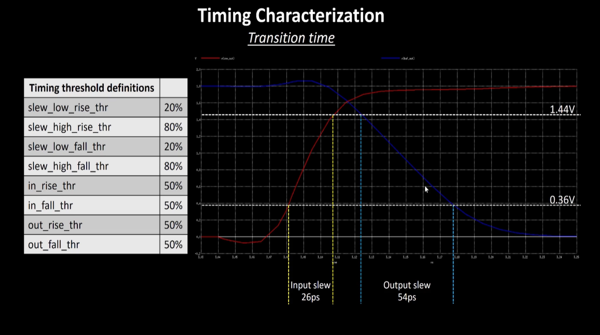

# DAY-2

# Lab steps to Floorplan:

-  Now, let’s see how, to floorplan in Openlane flow
-  To run floorplan go to the openlane prompt, and then run the command run_floorplan.
-  Now, to have a review at the results and reports, go to the directory, floorplan inside the results directory as shown below.
-  Here, we can see a file with a name picorv32a.floorplan.def
-  It is the file, which contains all the information regarding the floorplan.

 

 

-  Now, to see about the IO floorplanning go to the logs directory as shown below.
-  Go to the floorplan directory and their we can find so many files as shown below.
-  Now, open the file 4-ioPlacer.log file.

 

 

-  In this file, we can see the no, of pins, terminals and nets created as a result of floor planning.
-  If we want to make any changes within the foorplan, we have to make changes in design related config file.
-  Now, to can view the floorplan in the tool MAGIC
-  For that, run the following command.

 

 

- Now, you can view your floorplan in magic as follows:

 

 

 

-  Now, it’s time to run placement in openlane flow.
-  For this, run the command run_placement as follows
-  After running the above command, you will see as below:

 

 

-  Now, go to the results, floorplan directory inside the results directory as follows.
-  We can see a file is created with the name picorv32a.placement.def
-  Have a look at the file content.
  
   

   

- We can view the placement as follows:

 

 

- Placement ensures that Standard cells are properly placed or not.

 

 

 

## Cell design and characterization Flow:

 

 

- In a standard cell designing we have three steps:
     -  Giving inputs: It includes PDKs, DRC & LVS rules, Spice models, library and user defined specs.
     -  Design steps: It includes circuit designing, layout designing and characterization
     -  Having Outputs : It includes GDSII, CDL(Circuit Description language), Timing, noise, power libs.
- In the process of designing a standard cell, characterization process is one of the most important process as it checks whether the cell is working properly or not.
- The characterization flow that is being followed by the Industry is as follows: 
    - Reading the Model files.
    - .Read the extracted Spice net list.
    - Recognize the behaviour of the Inverter
    - Read the sub circuits of the Inverter.
    - Attach the necessary power source.
    - Apply the stimulus.
    - We have to provide necessary output capacitance.
    - We have to provide necessary simulation command.

- All the characterization process is done by the characaterization software GUNA
- This software will generate Timing, noise and power models.

 

 

 

## Timing Characterization:

Timing characterization includes various parameters.

 

 

- Let’s see these timing parameters one by one.

 

 

 

 

- The timing characterization, the selection of threshold points is very important.
- Here we can see negative delay, It is not correct because negative delay is not expected. 
- In practical case, we have to make sure that the delay should be positive or 0. But the delay should not be negative.
- In this case, the negative delay is because of poor selection of threshold points.
  
 

### Transition Time :

The transition is the time it takes for the pin to change state. When we calculate the transition time it should always high to low.

 

 

In the above diagram, we can see the threshold definitions for various timing parameters.

