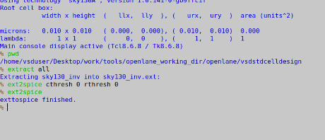
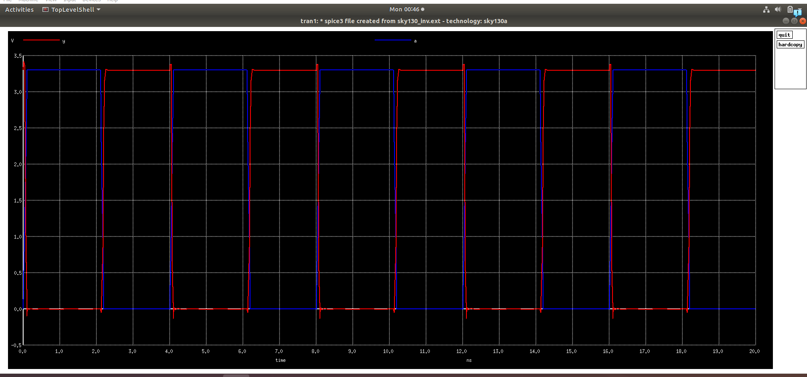

# DAY-3

# Library cell design in Magic & Characterization in ngSpice

## Spice Deck creation for CMOS:

SPICE deck refers to a text file written in SPICE (Simulation Program with Integrated Circuit Emphasis) syntax that describes the electrical behaviour of an integrated circuit (IC) component or a circuit net list 
A spice deck creation needs some information about the Component connectivity, it’s values and values for the nodes and it’s names.

 

 

There is a specific syntax for the Spice deck creation. The syntax for connectivity information for MOSFET is 
- MOSFET name (like M1 or M2), DRAIN, GATE, Source, Substrate, type of MOSFET (PMOS or NMOS), width, length. 
  
Let’s see the connectivity information of PMOS and NMOS separately.

 

 

 

- We will sweep the voltage at the input from 0 -2.5V with the step size of 0.05. Final step is describe the model file. Below description says the complete description for PMOS & NMOS means all technological parameters.

 

 

## Spice simulation for CMOS Inverter:

The Spice simulations are processed in ngspice. “ngspice” is an open-source electronic circuit simulator based on the SPICE (Simulation Program with Integrated Circuit Emphasis) simulation engine. It stands for "Next Generation SPICE." ngspice is widely used in VLSI (Very Large Scale Integration) design for simulating and verifying the behaviour of electronic circuits at the transistor level.

The steps to follow for SPICE simulation
-   Go to ngspice. 
-   Change the directory (where the related files kept).
-   Source the circuit file. it says the now the circuit is present in the ngspice simulator.
-   To execute the circuit, the command is run.
-   Give command setplot --> it will show which plots are currently available in the simulator.
-   Select the plot. Give command name as that plot name.
-   Give display command to see which nodes are available.
-   To plot the graph give command plot out vs in.
-   We can see the plot for above inputs. In this the width of both PMOS & NMOS is same.

 

 

- If we keep the width of PMOS is 2.5 times of NMOS, The whole procedure will be same, only the width of PMOS will vary.

 

 

## Switching threshold Vm:

- The switching threshold, also known as the switching threshold voltage or simply threshold voltage, is a critical parameter.
- Switching threshold it is the point where the Vin = Vout. and also both PMOS & NMOS are in saturation region. In saturation region, they will be turned on and becaouse of this there is high chance of leakage. In this case there is  high possibility that the current will flow directly from VDD to GND. In remaining areas one of the device turned off.so that there will not be direct path. Because of this conditions CMOS is a kind of short circuit device.
- CMOS is a robust device. Based on the W/L ratio, the properties of CMOS will vary. Because of this ratio only, the following two graphs are varying in their position but not in their shapes.

 

 

- CMOS Inverter’s robustness is essential for ensuring reliable performance across various operating conditions. One key aspect contributing to the robustness of CMOS inverters is their high noise immunity. By utilizing both NMOS and PMOS transistors in complementary pairs, CMOS inverters can effectively mitigate the impact of noise on the output signal, ensuring accurate signal processing in noisy environments. 

 

 

## Static and Dynamic simulations of CMOS Inverter

### Static simulation of CMOS inverter:
#### Static Simulation: 

- Static simulation of a CMOS inverter is a funDay3mental analysis aimed at understanding its DC characteristics and steady-state behavior. 
- Firstly, a DC analysis is conducted to determine the operating point of the CMOS inverter. This entails applying a DC voltage at the input and calculating the corresponding voltages and currents throughout the circuit to ensure proper transistor biasing.
- Then, the operation of both the NMOS and PMOS transistors within the inverter is assessed.
- The simulation verifies that the transistors operates at the saturation region, ensuring efficient switching and minimal power consumption.

#### Dynamic Simulation: 

- Dynamic simulation of a CMOS inverter is a critical analysis aimed at understanding its transient behaviour and response to input signal changes. 
- Firstly, the transient response of the CMOS inverter is examined, providing insights into how the output voltage evolves over time in reaction to input signal transitions. This assessment is crucial for determining the speed and efficiency of the inverter in processing dynamic signals.
- Secondly, the propagation delay of the inverter is evaluated, representing the time taken foe the output to switch between various logic levels in response to changes at the input. Propagation delay includes the time for signal propagation through the transistors and any effects from capacitive loading , offering valuable information about the inverter’s performance.

 

 

- As shown above, the delay is calculated for rise delay.
And similarly to check for fall delay, we have to check t the 50% of the fall edge of the output.

## Lab steps to make a CMOS inverter(StanDay3rd cell):

-  In this case we are not building the CMOS inverter form scratch, but we are using the existing design for checking furthur parameters related to building a stanDay3rd cell.
-  Now, we are taking Inverter design the github from the link as mentioned below.
    -   https://github.com/nickson-jose/vsdstdcelldesign.git 
-  To clone the gitlink, first go to the openlane directory, then run the following 
    -  git clone  https://github.com/nickson-jose/vsdstdcelldesign.git 

-  Now, we will get a folder which contains all dependencies and requirements for the StanDay3rd cell.
-  Now, go to the newly created directory in openlane directory, which contains inverter design.
-  You can see the following list of items present in the directory.

 

 

- Now, run the following command to view the Layot of the CMOS inverter in MAGIC

 

 

 

-  To select the whole layout, press S.
-  To place the layout at the centre of the window, press V.
-  To see a particular portion in a zoom view, press S to select a particular portion and then press Z, to zoom on that particular portion.
-  Now, if we want to know about the particular layer in the layout, follow the below steps:
    -  Select the particular portion or layer about which you want to know.
    -  Then, in the tkcon window, run the command “what”
    -  Then, you will get description about that particular layer in the tkcon window.
-  Some of the examples are mentioned below.

 

 

 

 

## Spice extraction of CMOS inverter in magic tool:

-  For the spice extraction of the custom inverter layout in magic, run the following commands:
     -  extract all  (to extract the design into sky130_inv.ext file )
     -  ext2spice cthresh 0 rthresh 0  (we’ll use sky130_inv.ext file to create the spice file to be used with our ngspice tool.)
     -  ext2spice (to convert ext to spice)

 

 

 

## Creating Spice deck using Sky130 tech :

-  The default file of SPICE deck using Sky130 tech is as follows:

 

 

-  To modify the file, use the following command to open the file in edit mode.
        ◦ vim sky130_inv.spice
-  Now, modify the Spice deck as follows:

 

 

 

## ngspice simulation of CMOS inverter:

-  To start the ngspice simulation, run the following command:
     -  ngspice sky130_inv.spice

 

 

 

## Timing Characterization of CMOS inverter:

 

 

 

 

 

## Converting tracks info into Grid info:
-  To convert the Tracks info Grid info, first we have to view the tracks info.

 

 

-  To activate the grid, press G, then we will see the default grid get activated.
-  Now, we have to make use of the li1 layer dimensions to convert tracks info to grid info as follows

 

 

- Now, the grid is formed as follows.

 

 

-  There are certain rules regarding the grid info.
-  Some of them are
    -  The input and output ports of the layout must be on the intersection of the vertical and horizental grids.
    -  The width of stanDay3rd cell is odd multiple of X-pitch.

 

## Introduction to Magic steps to load Sky130 tech-rules :

Now, in this session, we will see some of the DRC rules of sky130 tech.
-  For that, first we have to install a zip file.
-  The link for zip file is 
    -  http://opencircuitdesign.com/open_pdks/archive/drc_tests.tgz
-  After downloading the zip file, launch the magic tool using the following command.
    - magic
-  After the magic has launched open the file met3.mag as follows:

 

 

 

- Now, after opening met3.mag file, you can see as follows:

 

 

- Now, select one of the layer from the above mentioned layers and then in tkcon window, run the command box, to see the information regarding the layer.

 

 

 

 

## How to fix poly.9 error iin sky130 tech file:

The "poly.9" error encountered in Magic layout typically points to an issue with the polygon layer within the layout file. In Magic, layers are often denoted by their corresponding technology layers, with "poly" usually representing the polysilicon layer used for gates and interconnections. The "9" likely refers to a specific polygon or layer number within this polysilicon layer stack. 
-  Type load poly in console window. It will show available poly's. Some incorrect poly's are also there.

 

 

 

 

 

 

 

 

