# DAY-4

## Lab steps to convert magic layout to STD cell LEF:

- Now layout is done as per the pnr tool.
Whenever we make the layout we just define the layers and contacts.  Now, we have to specify the ports which are available, and their funcionality.
- And in this process, we will give specific names to the ports as shown below:

 

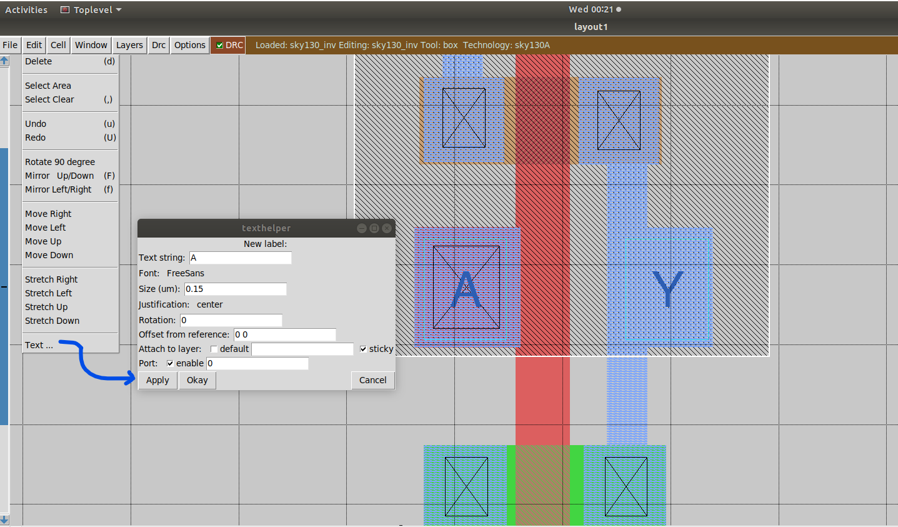

 

 

- Now, we can see whether the ports are assigned with name and it’s corresponding functionality.

 

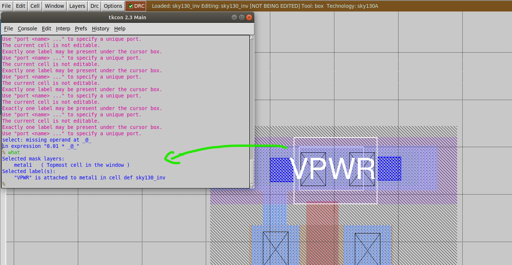

 

 

## Introduction to timing libs and adding a new cell in synthesis:
The timing libraries (timing libs) are sets of data files that contain timing information necessary for timing analysis during the design implementation process. These libraries provide crucial timing constraints and models for the standard cells, IO pads, and other elements of the design.
-  Now we can extract the lef file. 
-  Next save the design into some another file as shown below:

 

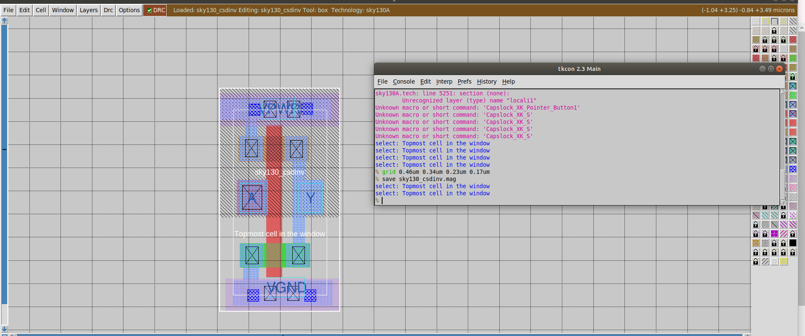

 

Then, we can view the cell design inside the vsdstdcelldesign directory as shown below:

 

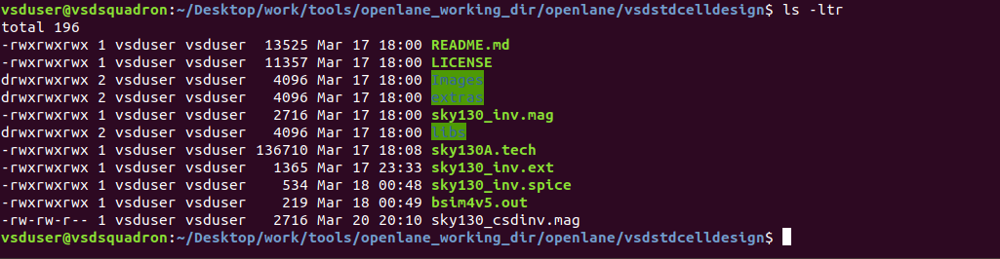

 

- Now, to create the lef file of the above design, run the below command in the tkcon window:
    -  write lef

 

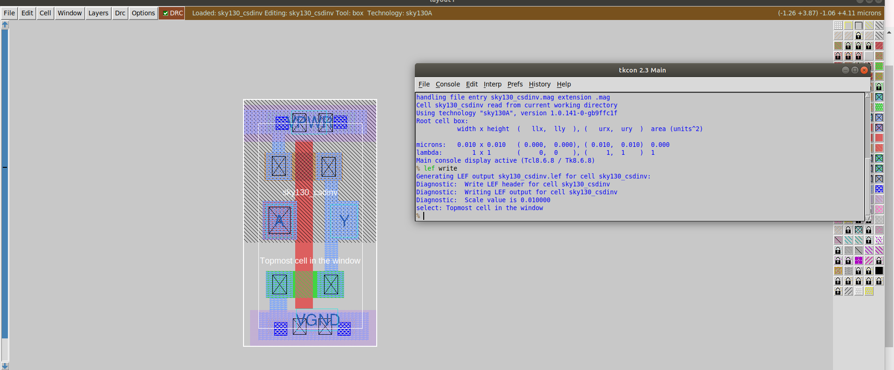

 

- Now, you will see a lef file has been created in the  vsdstdcelldesign directory

 

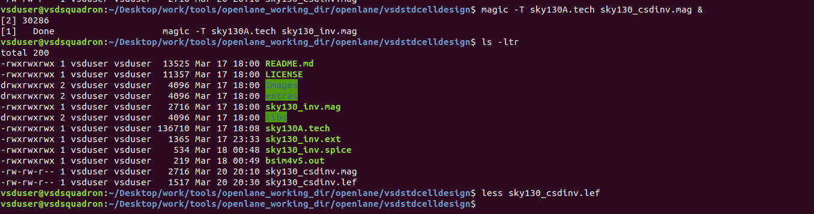

 

- Now, move this lef file to picorv32a design files as shown below:

 

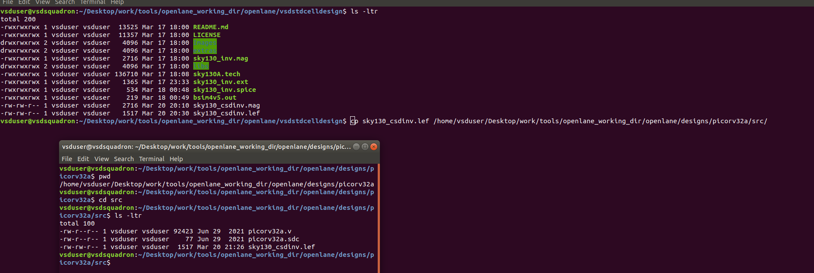

 

- Now, to include our standard cell into the design, we will have libraries, which includes custom cell definitions:

 

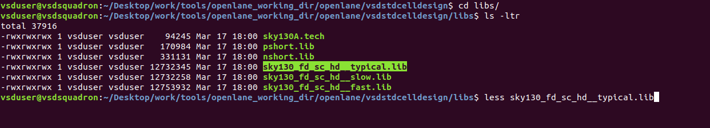

 

- We can see the above libraries as follows:

 

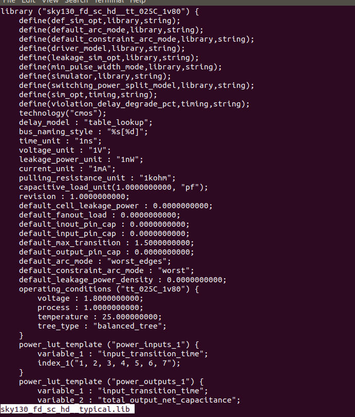

 

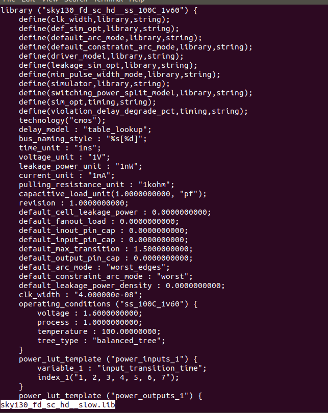

 

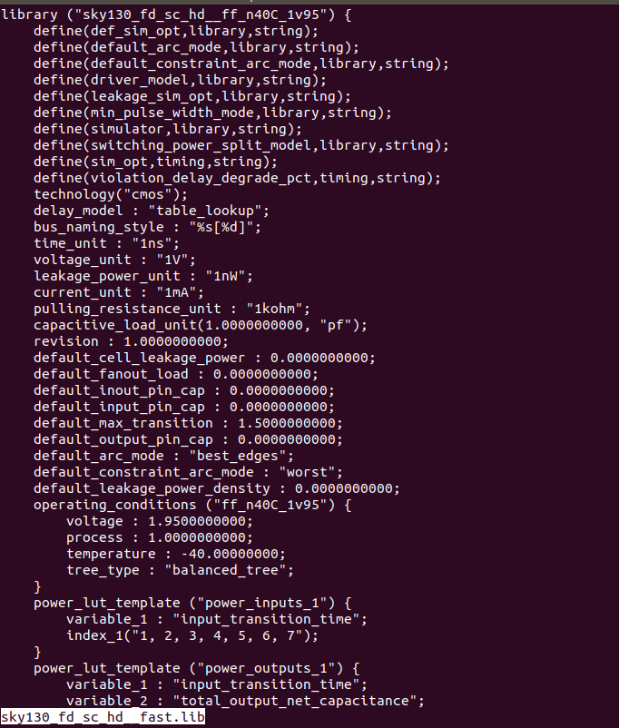

 

-  Now, we have to run the synthesis again, to include the custom cell into the design.
-  Before that, we have to modify the config file with the commands as shown below:
  

 

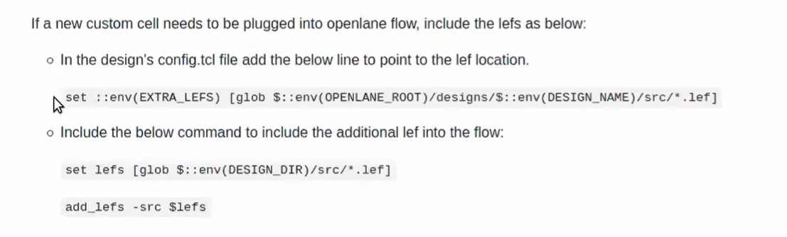

 

- Now, we can see the modified config file as follows

 

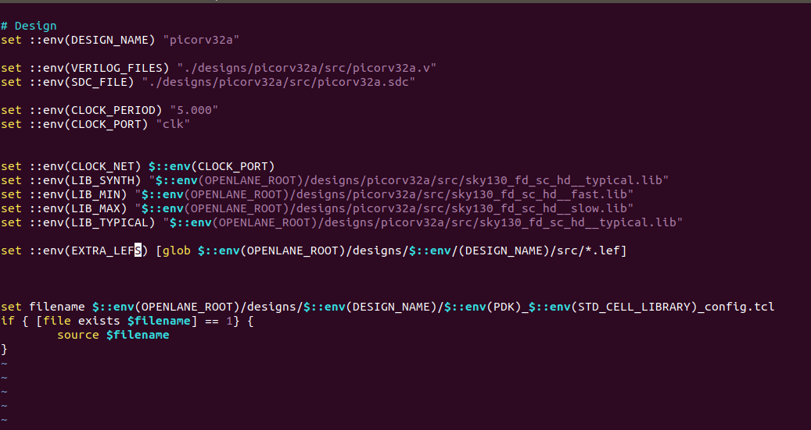

 

- Now, go to the oepnlane flow
- And, run the following command to sun the synthesis
    -  run_synthesis

 

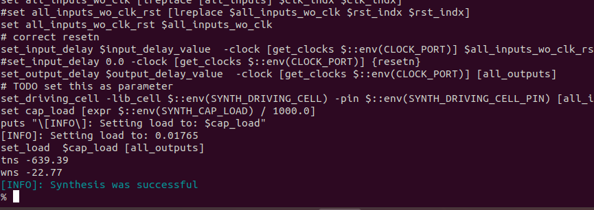

 

- After completion of Synthesis, we have to check whether the standard cell is included in the design or not.

 

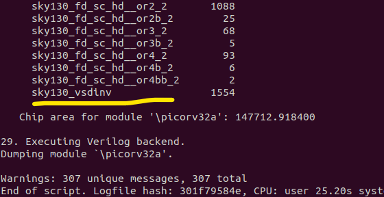

 

-  Now, we made sure that the cell is included in the design.
-  Now, let’s see the custom cell that is included in the design using magic layout.

 

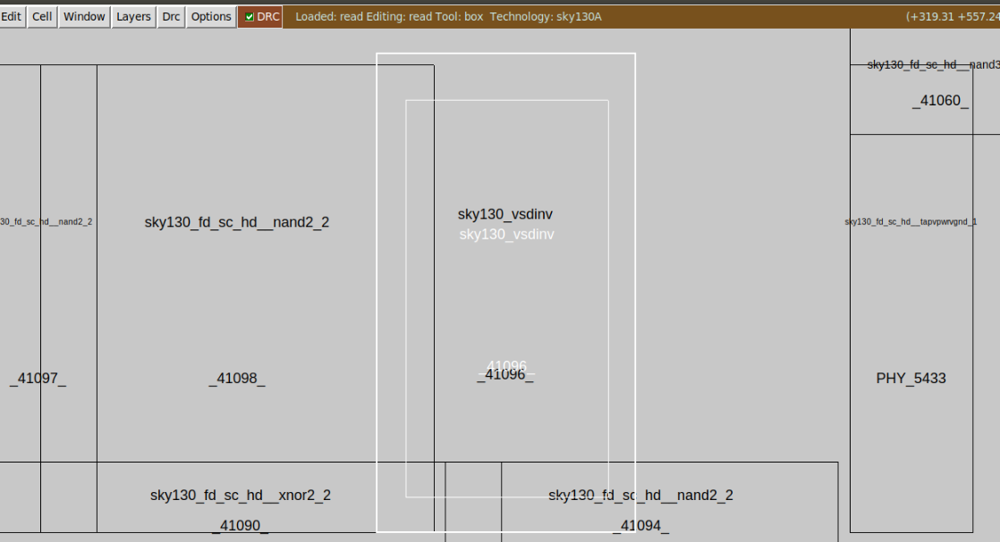

 

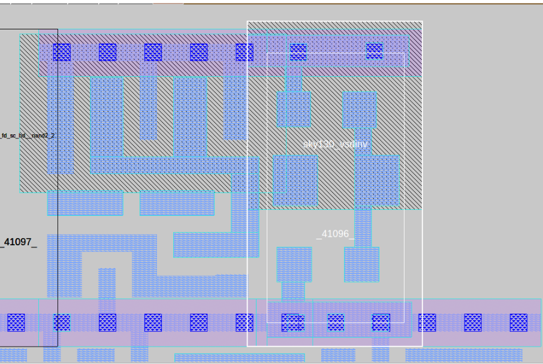

 

- We can clearly see that the custom cell is successfully included in the layout.

### Steps to fix slack during synthesis:
-  As we see in the synthesis process, the slack is negative that is violated. 
-  In practical, we have to make sure that the slack should be positive.
-  To fix the slack, we have to run the synthesis again, but using different strategies.
-  We have to improve the slack, and as a result of this, the size of the design will also increase 
-  Below, we can see the chip area before using the different strategy to improve the slack.

 

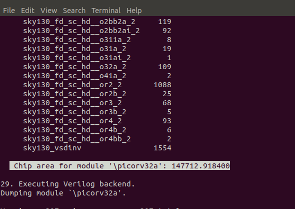

 

- Run the following commands in the openlane flow, to rerun the synthesis in order to improve the slack.

 

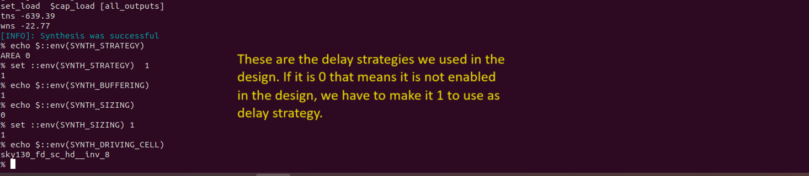

 

-  As we can see in above diagram, we set the synthesis strategy as 1.
-  We can have a look at the different strategies in openlane flow, in the file README.md under the directory openlane.
-  And now, we will expect an increase in the area of the chip as shown below:

 

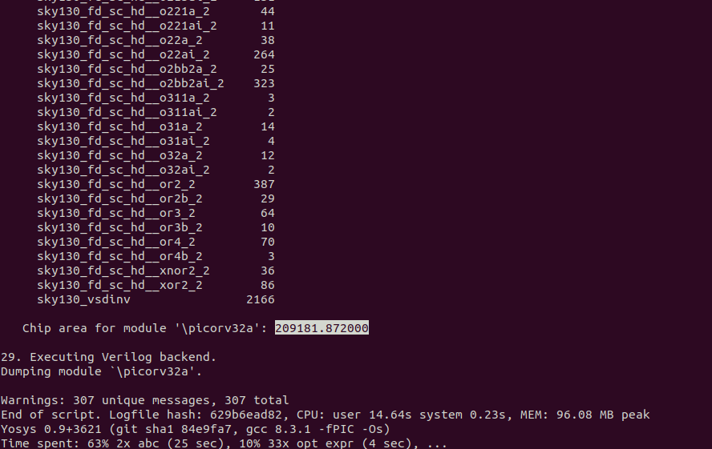

 

- In this way, we can improve the slack upto a great extent.

## Lab steps to configure openSTA for post-synth timing analysis:

-  Now, in this case, for timing analysis, we are using the tool OpenSTA.
-  For this purpose , we have to create a new file as shown below:

 

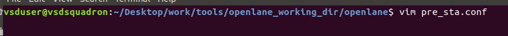

 

- This is the configuration file on which we will do pre-layout analysis 
- Now, go to the file my_base.sdc as shown below:

 

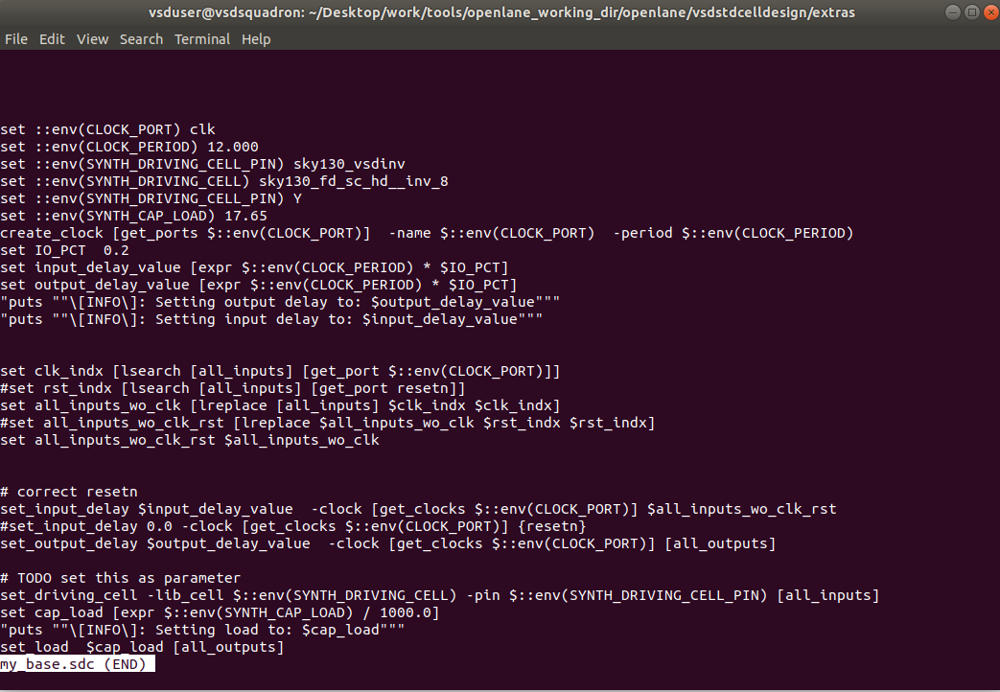

 

-  This file conatins, the timing related constraints of our deisgn.
-  STA can either be single corner which only uses the LIB_TYPICAL library which is the one used in pre-layout(pos-synthesis) STA or multicorner which uses LIB_SLOWEST(setup analysis, high temp low voltage),LIB_FASTEST(hold analysis, low temp high voltage), and LIB_TYPICAL libraries 
-  Now, go to file /openlane/scripts/openroad/sta.tcl as shown below:

 

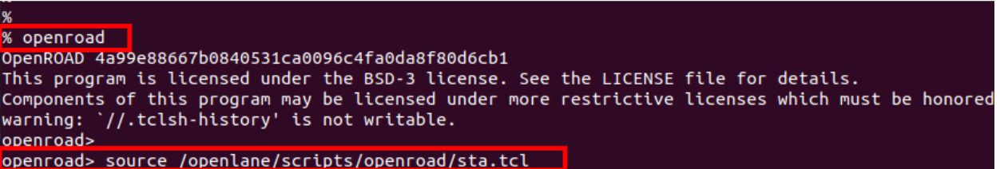

 

-  Above file contains the OpenROAD commands for single corner STA. This file also contains the path to the SDC file which specifies the actual timing constraints of the design. 
-  Now, to do the Post_synthesis STA, we have to start the openroad.
-  For that purpose, run the following command in the openlane flow: 
    -  openroad

-  The result of running STA in OpenROAD will be exactly the same as the log result of STA after running run_synthesis inside OpenLane. In the below figure, we can observe the delay clearly:

 

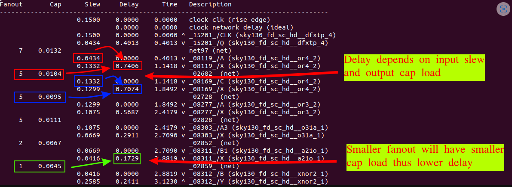

 

-  Now, to improve the slack, we have to focus on the large delays.
-  For this purpose, we have to replace the large delay elements within the design with the low delay elements of the same functionalities.
-  In this, case, we are replacing the large delay buffers, with the buffers with small delay.
-  This is known as the upsizing of the buffers, which includes, the replacement of the cells.
-  Again, we have to do the STA analysis and check for the slack.
-  If it have to improve much more, again we have to do the same process and have to replace any other cells with the small delay cells.

 

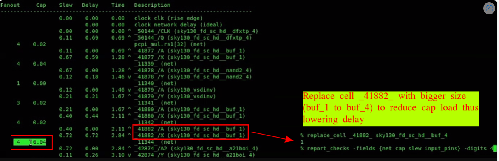

 

-  In this case, while we are improving the slack, we are replacing the small buffers with large buffers, in order to reduce the slack.
-  So, the chip size also increase simultaneously.

 

## Lab steps to run CTS:

-  In this process, we will build a clock tree, in order to pass the clock signal to all the flops in the design simultaneously.
-  To run the cts in openlane flow, run the commmand as shown below:
    - run_cts
-  After the process has done, we can review the reports and results in the picorv32a directory.

