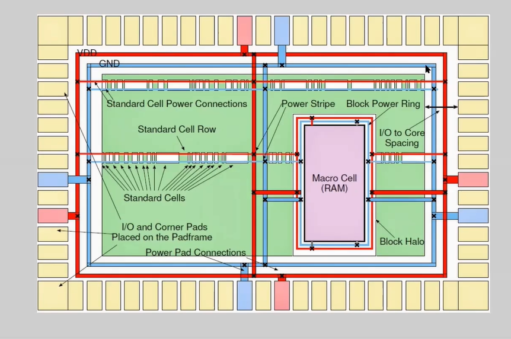
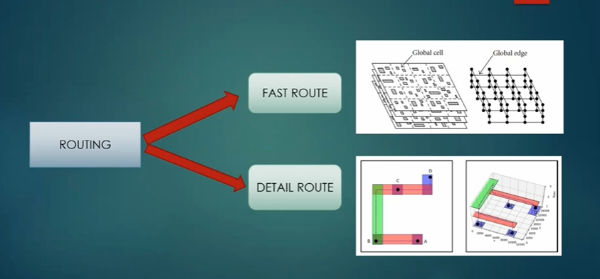
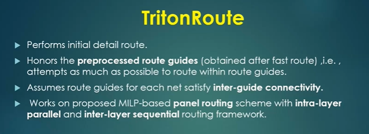
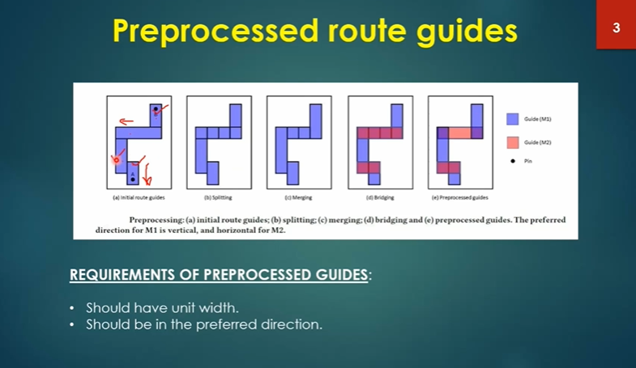
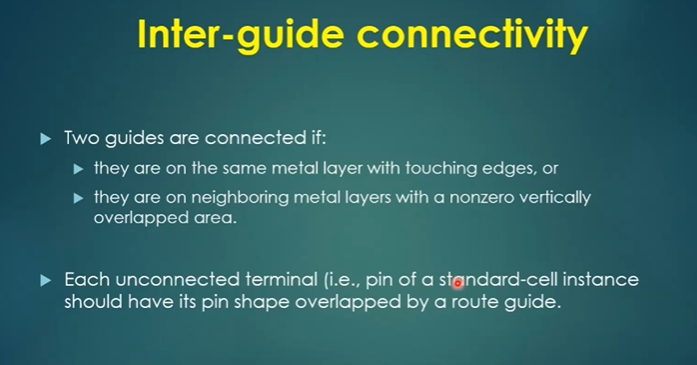
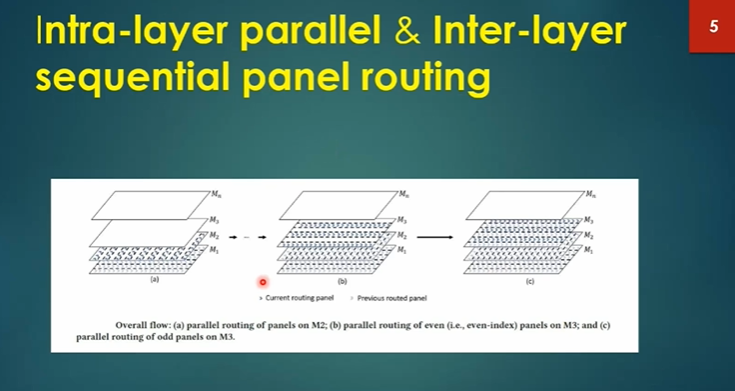
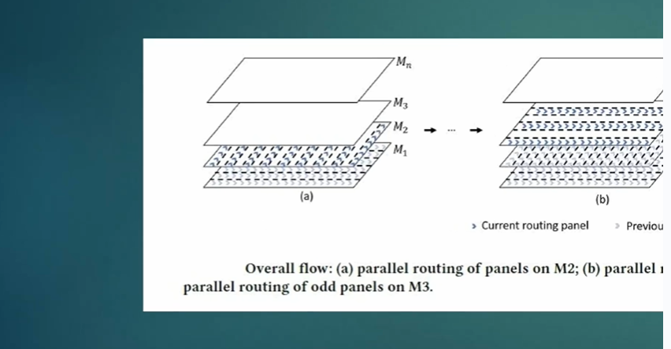
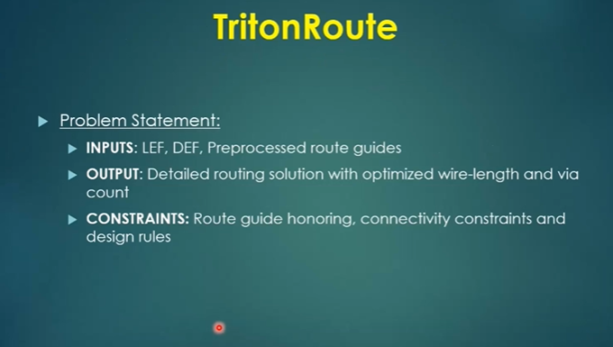
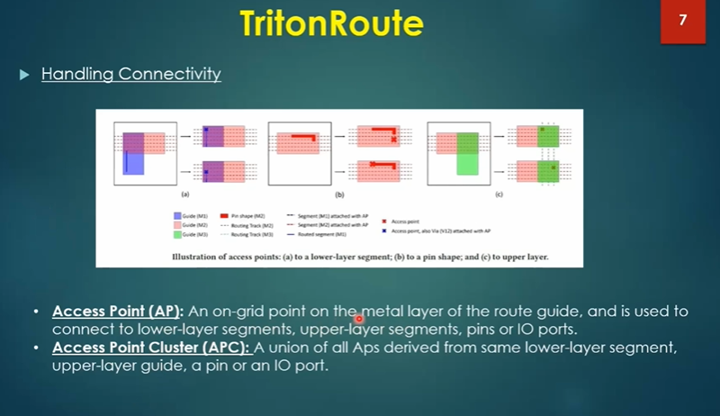
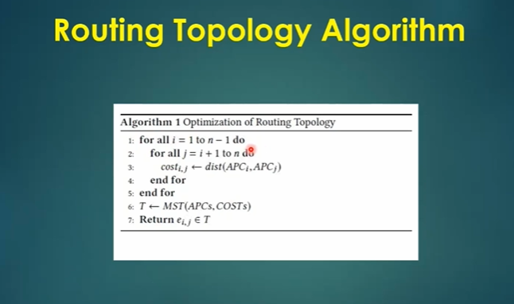

# Final Steps for RTL to GDSII

## Building Power Distribution Network(PDN):
The PDN efficiently distributes power across the chip, maintaining stable voltage levels through voltage regulation mechanisms and strategic placement of decoupling capacitors. OpenLAN facilitates detailed analysis of voltage drops through IR drop analysis tools, enabling designers to optimize the network layout and minimize power supply noise. 

### Steps to build PDN in Openlane:
Go to openlane directory
-    Go to the Openlane flow 
-    Run the following command to know the last step happened in the openlane flow.
     - echo :: $env(CURRENT_DEF)
-    Generate the following command to run the PDN.
     - gen_pdn
-    It will read the merged.lef & cts.def. Then it will create the grids and straps for the power and Ground.

 

## Power Straps To STD cell power :
This process includes the placement of power pads, power straps, and decoupling capacitors to address challenges such as power density, IR drop, and thermal effects, thereby ensuring the reliability and performance of the IC. 
Power planning is done to provide uniform supply voltages to all the cells in design the primary objective of power planning is to ensure that all on chip components like blocks, memory, IO cells etc have adequate power and ground connections. There are three levels of power distribution.

 

 - Power Rings:
  
    -  Power rings are the highest level of the PDN hierarchy, encircling entire sections or functional blocks of the chip. They serve as primary conducts for distributing power uniformly across the IC.
    -  Power rings ensure that all components within their enclosed areas receive stable and adequate power supply, minimizing voltage drops and ensuring consistent performance.
          
 - Power Strips:
  
    -  Power strips are the intermediate level of the PDN hierarchy, connecting power rings to specific regions or groups of components within the IC.
    -  Power strips facilitate localized power distribution, ensuring efficient power delivery to targeted areas of the chip. They help manage impedance and minimize voltage fluctuations within critical circuitry.
          
-  Power Rails:
  
    -  Power rails represent the lowest level of the PDN hierarchy, consisting of individual lines or metal layers within the IC that deliver power directly to the active components.
    -  Power rails serve as the final stage of power distribution, ensuring that each component receives the required voltage levels for proper operation. They play a crucial role in maintaining power integrity and preventing performance degradation.

 

 

## Introduction to Global and detail routing and configure TritonRoute:
- Routing in OpenLane, particularly using TritonRoute, involves the process of determining physical paths for interconnections between various components on an integrated circuit (IC) design. TritonRoute, a detailed routing tool integrated into OpenLane, plays a vital role in optimizing these connections while adhering to design rules and constraints. 
- TritonRoute performs both global and detailed routing. Global routing establishes high-level routing architectures, determining the approximate paths for each net. Detailed routing fine-tunes these paths, considering specific physical constraints and optimizing for factors such as signal integrity, timing, and manufacturability. 
- Global Route / Fast Route : It is being done by fast route. 
- Detail Route : It is being done by tracking route.

 

 

- Fast route is followed by the Detail route.
- Detail route should ensure that it needs to realize the segments and via in accordance with the global route solution.

 

 

## Preprocessed route guides:
Pre-processed route guides in TritonRoute refer to predefined routing constraints or guidelines provided to the router before the routing process begins. These guides help steer the router towards achieving more efficient and effective routing solutions while adhering to specific design requirements.  
 The steps involved in preprocessed route guides in TritonRoute can be broken down into several key stages: initial route guides, splitting, merging, bridging, and final preprocessed route guides. 

 

- Initial Route Guides:
    -  The process begins with defining initial route guides based on design specifications, constraints, and optimization goals. Initial route guides provide the foundation for guiding the routing process and serve as a starting point for subsequent steps. 
- Splitting:
    -  In the splitting stage, the routing space defined by the initial route guides is divided into smaller segments or channels to facilitate efficient routing. Splitting involves partitioning the routing area into manageable sections, allowing the router to focus on routing within specific regions. This step helps reduce routing congestion and optimize routing resources.
- Merging:
    -  After splitting the routing space, the merging stage involves consolidating adjacent routing segments or channels to streamline the routing process. Merging combines neighboring routing areas to create larger routing regions, enabling the router to generate more contiguous routing paths. This helps minimize discontinuities in the routing topology and improves overall routing efficiency.
- Bridging:
    -  Bridging entails establishing connections between separate routing segments or channels to enable signal propagation across the routing space. This step involves creating bridges or crossover routes to link adjacent routing regions and ensure connectivity between nets or signal paths. Bridging helps maintain signal integrity and facilitates efficient signal routing throughout the design.
- Final Preprocessed Route Guides:
    -  The final stage involves refining and optimizing the preprocessed route guides to align with design objectives and routing constraints. This includes adjusting routing directions, layer assignments, pin access points, and other parameters to achieve desired routing outcomes. The final preprocessed route guides provide comprehensive guidance to the router for generating high-quality routing solutions that meet design requirements

 

 

## Inter-guide Connectivity:
Inter-guide connectivity refers to the establishment of connections between different routing guides or channels within the routing space This connectivity enables signal propagation across segmented routing regions, ensuring continuous and efficient routing paths for interconnecting components and nets.

 

 

## Intra-layer parallela & Inter-layer sequential panel routig:
Two common routing techniques are intra-layer parallel routing and inter-layer sequential panel routing. 
- Intra-layer Parallel Routing:
    -  Intra-layer parallel routing involves routing multiple nets or signal paths simultaneously within the same metal layer of the IC layout. This technique maximizes routing efficiency by utilizing the available routing resources in parallel, allowing multiple signals to be routed concurrently.
    -  Parallel routing is particularly effective for dense designs where routing congestion is a concern. By routing nets in parallel, it helps alleviate congestion and reduces routing delays, thereby improving overall timing and signal integrity
- Inter-layer Sequential Panel Routing:
    -  Inter-layer sequential panel routing involves routing nets sequentially across multiple metal layers of the IC layout, with each layer routed in isolation before moving to the next layer. This technique allows for efficient utilization of routing resources across different layers while maintaining signal integrity and design rule compliance.
    -  Sequential panel routing is commonly used in multi-layer IC designs where vertical interconnects (vias) are employed to establish connections between different metal layers. By routing nets sequentially, it ensures proper alignment of vias and minimizes signal crosstalk and interference between adjacent layers.

 

 

 

Let’s see how, trintonroute handles the process of routing and what are the parameters required for the tritonroute.

 

 

- The Tritonroute handles the connectivity in the following way.

 

 

## Routing topology algorithm:
Routing topology algorithms aim to find the optimal arrangement of routing paths between components while adhering to design rules, constraints, and optimization objectives. They play a crucial role in determining the overall efficiency, performance, and manufacturability 

 

 

## Parasitic extraction in OPENLANE:
-  Go to Desktop/work/tools
-  Here, you can see a file related to parasitic extration, i.e., spef_extraction_python3.py
-  Go to the directory tmp/routing/picorv32a.def 
-  Above file create the spef file.
-  The spef file is also saved in the same location.
-  The new def file will create in the above location picorv32a_new.def
-  this def file will be replaced by spef file picorv32a.spef which is our final file of extracted parasites.

